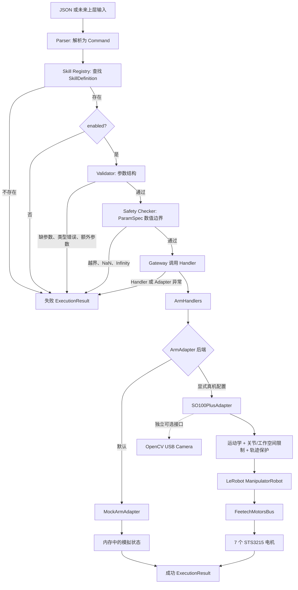

# RosClaw Mini

RosClaw Mini 是一个面向机械臂控制教学和原型验证的 Python 项目。它要解决的核心问题不是“怎样直接给电机发命令”，而是：

> 怎样让一条上层命令先经过结构校验、技能查询和安全检查，再通过统一接口落到 Mock 或真实机械臂。

当前仓库已经完成默认 Mock 主链路，以及 SO-100 Plus 单臂适配器、运动学、固定姿态工作空间、运行保护和可选摄像头接口。统一 JSON 入口支持显式选择 `mock` 或 `so100_plus`；默认仍是 Mock，真机还必须额外确认连接、上力和运动风险。

> [!IMPORTANT]
> 普通启动命令和默认 `pytest` 不会连接真实机械臂、启用力矩、修改校准或打开摄像头。`SO100PlusAdapter.connect()` 则不是只读操作：它会连接电机、同步目标、写入运行参数并启用力矩。执行任何真机脚本前，操作者必须在机械臂旁、清空路径，并能立即物理断电。

## 阅读导航

- [1. 当前项目处于什么阶段](#1-当前项目处于什么阶段)
- [2. 快速开始：先运行 Mock](#2-快速开始先运行-mock)
- [3. 整体架构和思维导图](#3-整体架构和思维导图)
- [4. 一条命令怎样执行](#4-一条命令怎样执行)
- [5. 核心对象、Skill 和 Adapter](#5-核心对象skill-和-adapter)
- [6. SO-100 Plus 真机接入](#6-so-100-plus-真机接入)
- [7. 坐标、TCP 和 `move_to()`](#7-坐标tcp-和-move_to)
- [8. 安全边界和已保存的真机配置](#8-安全边界和已保存的真机配置)
- [9. 摄像头是独立可选功能](#9-摄像头是独立可选功能)
- [10. Python 调用示例](#10-python-调用示例)
- [11. 测试、仿真和真机工具](#11-测试仿真和真机工具)
- [12. 已经完成的真机验证](#12-已经完成的真机验证)
- [13. 项目结构](#13-项目结构)
- [14. 当前限制和下一步](#14-当前限制和下一步)
- [15. 延伸文档](#15-延伸文档)

## 1. 当前项目处于什么阶段

### 一句话结论

当前阶段已经完成“真实 SO-100 Plus 单臂的底层接入、受控验证和 JSON 主链路装配”。真机入口已经可启动，但仍属于需要操作者在场的教学原型，不是无人值守应用。

### 完成状态

| 能力 | 当前状态 | 是否进入默认入口 |
| --- | --- | --- |
| `Command` / `SafetyResult` / `ExecutionResult` | 已实现 | 是 |
| `SkillDefinition` / `ParamSpec` | 已实现 | 是 |
| Skill Registry、Validator、Safety Checker、Gateway | 已实现 | 是 |
| `ExecutionController` 后台执行与 `stop` 请求 | 已实现 | 是 |
| `ArmHandlers` / `ArmAdapter` | 已实现 | 是 |
| `MockArmAdapter` | 已实现 | 是，默认后端 |
| `SO100PlusAdapter` | 已实现并经过真机验证 | 是，必须显式选择真机并确认风险 |
| SO-100 Plus FK、IK、TCP 和关节路径 | 已实现 | 是，由真机运行时装配 |
| 当前 `right_follower` 正式工作空间 | 已登记 `12 × 6 × 12 cm` 固定姿态可达长方体 | 可通过专用 Skill 构造函数使用 |
| 运行期负载、温度、跟踪误差和到位检查 | 已实现并保存真机参数 | 否，由真机 Adapter 使用 |
| USB 摄像头接口 | 软件接口和 FakeCamera 测试完成 | 否，真实单帧尚未验收 |
| 可选择 `mock/so100_plus` 的统一应用入口 | 已实现，默认 `mock` | 是 |
| 配置文件加载 | `configs/*.yaml` 仍为空且未接线 | 否 |
| LLM、RAG、Web、ROS 2 | 尚未形成可用链路 | 否 |

### 现在可以安全做什么

- 运行默认 Mock 交互入口；
- 运行完整单元测试；
- 离线计算 FK、IK、TCP 和轨迹；
- 在 MuJoCo 中查看模型、TCP 和路径；
- 阅读已保存的真机配置和验证报告。

### 哪些操作会接触真实设备

- 创建并连接真实 `SO100PlusAdapter`；
- 运行带 `--acknowledge-...` 参数的真机脚本；
- 运行摄像头检查脚本；
- 运行 PID EEPROM 调参脚本。

## 2. 快速开始：先运行 Mock

### 环境

本项目当前开发环境使用 Python 3.10，Conda 环境名为：

```text
rosclaw-mini-py310
```

仓库根目录的 `pyproject.toml` 目前只保存 pytest 基础配置，`requirements.txt` 还没有完整声明真机依赖。因此下面的命令假设该 Conda 环境已经准备好。

```bash
conda activate rosclaw-mini-py310
cd rosclaw-mini
```

### 启动默认入口

```bash
PYTHONPATH=src python -m rosclaw_mini.main
```

不传 `--backend` 时，入口固定选择 `MockArmAdapter`，不会访问 `/dev/lerobot_right`。它接受结构化 JSON，不会调用大语言模型。

移动 Mock TCP：

```json
{"skill_name": "move_arm", "params": {"x": 0.5, "y": 0.4, "z": 0.3}}
```

夹爪与停止：

```json
{"skill_name": "open_gripper", "params": {}}
{"skill_name": "close_gripper", "params": {}}
{"skill_name": "stop", "params": {}}
```

查看后台命令结果：

```text
result
```

退出：

```text
exit
```

`main.py` 中的 Mock 移动默认持续 5 秒，目的是让后台执行和运动中 `stop` 更容易观察。正在执行普通动作时不能再提交第二个普通动作，但仍可以提交 `stop`。

### 显式启动 SO-100 Plus

> 下面的命令会连接真实机械臂并启用力矩。这里只记录入口用法；本次 README 更新没有执行该命令。

```bash
PYTHONPATH=src:lerobot-joycon_plus python -m rosclaw_mini.main \
  --backend so100_plus \
  --port /dev/lerobot_right \
  --calibration-dir lerobot-joycon_plus/.cache/calibration/so100_plus \
  --follower-name right \
  --acknowledge-so100-plus-risk
```

真机运行时复用现有 `SO100PlusRobotConfig`、Factory、运动学、正式 `MotionLimits`、`SO100PlusAdapter` 和 `build_so100_plus_right_follower_arm_skills()`。缺少风险确认时，程序会在创建 Robot 和访问串口之前拒绝启动。

连接后，入口会读取六个手臂关节并用 FK 打印当前 TCP。只有启动 TCP
已经位于 `SO100_PLUS_RIGHT_FOLLOWER_WORKSPACE_LIMITS` 内时，JSON
`move_arm` 才保持启用；如果机械臂仍处于 `follower_rest` 等正式工作区外
姿态，运行时会失败关闭 `move_arm` 并打印原因。此时 `stop`、
`open_gripper` 和 `close_gripper` 仍可使用。当前统一入口不会猜测或自动
执行 `follower_rest → JoyCon 初始工作姿态` 的展开轨迹；使用已单独
验收的流程进入工作区后，需要重新启动统一入口，启动门禁才会重新判断。

输入 `exit`、输入结束或按下 Ctrl+C 时，运行时会：

```text
stop()
→ 等待后台动作结束
→ disconnect()
```

普通退出不会调用 `disable_torque()`。

### 运行测试

```bash
python -m pytest -q
```

当前仓库验证结果：

```text
255 passed
```

默认测试全部使用 Mock、FakeRobot、FakeBus 或 FakeCamera，不打开真实串口和视频设备。

## 3. 整体架构和思维导图

项目遵守下面的边界：上层只表达意图，真实硬件差异只进入 Adapter，电机驱动不会被 Skill Handler 直接调用。



摄像头画成虚线，是因为它由 `SO100PlusAdapter` 暴露统一接口，但生命周期与机械臂连接完全独立：不配置摄像头也能连接机械臂，机械臂未连接时也能单独抓图。

### 各层说人话解释

| 层 | 本项目中的具体含义 | 不应该做什么 |
| --- | --- | --- |
| Parser | 把 JSON 字符串变成 `Command` | 不连接硬件，不判断真实路径 |
| Skill Registry | 按名字找到 `SkillDefinition` | 不执行动作 |
| Validator | 检查参数是否齐全、类型是否正确、有没有多余字段 | 不写电机 |
| Safety Checker | 读取 `ParamSpec` 的上下限并检查数值 | 不为每个 Skill 写一堆硬编码分支 |
| Gateway | 按固定顺序组织查找、校验、检查和执行 | 不直接调用 Feetech 驱动 |
| ArmHandlers | 把 Skill 映射成一个或多个 Adapter 原子动作 | 不直接依赖 LeRobot |
| ArmAdapter | 把不同硬件驱动统一成 `move_to()` 等操作 | 不解析 Command，不生成 `ExecutionResult` |
| 厂商驱动 | 最终读写串口、电机寄存器和相机 | 不暴露给上层业务命令 |

真实机械臂上的直观映射是：

```text
上层统一接口
→ SO100PlusAdapter
→ LeRobot ManipulatorRobot
→ FeetechMotorsBus
→ 7 个 STS3215 电机
```

## 4. 一条命令怎样执行

以 `move_arm` 为例：

```text
{"skill_name": "move_arm", "params": {"x": ..., "y": ..., "z": ...}}
→ parse_json_command()
→ Command
→ run_command(command, skills)
→ find_skill("move_arm")
→ 检查 enabled
→ validate_skill_params()
→ check_command()
→ ArmHandlers.move_arm()
→ adapter.move_to(x, y, z)
→ ExecutionResult
```

Gateway 的失败顺序也很明确：

1. Skill 不存在：返回 `技能不存在`；
2. Skill 存在但未启用：返回 `技能未启用`；
3. 参数缺失、类型错误或多余：Validator 拒绝；
4. 参数数值越界或不是有限值：Safety Checker 拒绝；
5. Handler 或 Adapter 抛出异常：Gateway 转成失败的 `ExecutionResult`；
6. 正常完成：Handler 返回成功的 `ExecutionResult`。

### 后台执行与停止

`ExecutionController` 用一个后台线程执行普通命令：

```text
controller.submit(move_command)
→ 后台运行 Gateway
→ 主线程仍可接收 stop
→ controller.request_stop(stop_command)
→ adapter.stop()
```

它当前只允许一个普通命令同时运行。`stop` 走单独入口，不需要等待正在执行的移动先返回。

## 5. 核心对象、Skill 和 Adapter

### 核心数据对象

| 对象 | 关键字段 | 作用 |
| --- | --- | --- |
| `Command` | `command_id`, `skill_name`, `params`, `source` | 描述要做什么 |
| `SafetyResult` | `command_id`, `is_safe`, `risk_level`, `reason` | 描述安全检查结论 |
| `ExecutionResult` | `command_id`, `skill_name`, `success`, `message` | 统一返回执行结果 |
| `ParamSpec` | 类型、必填、上下限、开闭区间 | 描述一个参数允许什么值 |
| `SkillDefinition` | 名字、描述、风险、启用状态、参数表、Handler | 把 Skill 元数据与执行入口放在一起 |

当前 `risk_level` 会进入安全结果，但项目还没有实现完整的用户身份、动态审批和分级授权系统。

### 当前内置 Skill

`build_arm_skills(adapter, workspace_limits)` 创建五个 Skill：

| Skill | 风险等级 | 参数 | Adapter 映射 | 默认状态 |
| --- | --- | --- | --- | --- |
| `move_arm` | `medium` | `x`, `y`, `z` | `move_to(x, y, z)` | 只有显式提供工作空间才启用 |
| `open_gripper` | `low` | 无 | `open_gripper()` | 启用 |
| `close_gripper` | `low` | 无 | `close_gripper()` | 启用 |
| `stop` | `low` | 无 | `stop()` | 启用 |
| `disable_torque` | `high` | 无 | `disable_torque()` | 默认禁用 |

`disable_torque` 默认禁用的是 Gateway/普通命令入口，不是删除 Adapter 的卸力能力。受控维护流程仍可直接调用 Adapter；普通卸力必须先验证机械臂处于 `follower_rest`。

复杂 Skill 应在 Handler 层组合原子动作。例如未来的 `pick` 可以是：

```text
open_gripper()
→ move_to(物体上方)
→ move_to(抓取位置)
→ close_gripper()
→ move_to(抬起位置)
```

当前仓库没有把这个示例实现成正式 `pick` Skill。

### `ArmAdapter` 原子操作

| 接口 | 统一含义 |
| --- | --- |
| `is_connected` | 查询机械臂后端连接状态 |
| `connect()` | 连接后端 |
| `disconnect()` | 断开后端通信 |
| `move_to(x, y, z)` | 把夹爪 TCP 移到绝对坐标 |
| `open_gripper()` | 打开夹爪 |
| `close_gripper()` | 关闭夹爪 |
| `stop()` | 取消剩余动作并保持当前位置 |
| `disable_torque(emergency=False)` | 在满足收纳条件后关闭力矩；紧急路径必须显式指定 |

`SO100PlusAdapter` 还提供 `move_joints()` 和摄像头方法，但它们目前不是所有机械臂后端共同保证的基础接口，也没有映射成普通上层 Skill。

## 6. SO-100 Plus 真机接入

### 已确认的当前设备

| 项目 | 当前值 |
| --- | --- |
| 型号 | SO-100 Plus 单臂 |
| follower 名称 | `right` |
| 稳定串口别名 | `/dev/lerobot_right` |
| 校准文件 | `right_follower.json` |
| 校准目录 | `lerobot-joycon_plus/.cache/calibration/so100_plus` |
| 电机 | 7 个 STS3215 |
| 电机总线 | LeRobot `FeetechMotorsBus` |
| 机器人包装 | LeRobot `ManipulatorRobot` |

这些配置只属于当前这台 `right_follower`。更换 follower 名称时，Factory 会按 `<follower_name>_follower.json` 寻找校准文件，不能随机复用当前文件。

### 电机映射

| ID | 驱动名称 | 机械作用 |
| ---: | --- | --- |
| 1 | `shoulder_rotation_joint` | 底座旋转 |
| 2 | `shoulder_pitch_joint` | 肩部俯仰 |
| 3 | `ellbow_joint` | 肘关节；拼写沿用驱动源码 |
| 4 | `wrist_pitch_joint` | 腕部俯仰 |
| 5 | `wrist_jaw_joint` | 腕部偏航 |
| 6 | `wrist_roll_joint` | 腕部滚转 |
| 7 | `gripper_joint` | 夹爪开合 |

前六个关节参与 FK 和 IK，第七个由夹爪动作单独控制。

### 连接前 Factory 会检查什么

`SO100PlusRobotConfig` 保存串口、校准目录和 follower 名称。`validate_so100_plus_config()` 在打开串口前检查：

- follower 名称是不是简单标识符；
- 串口是否存在且为字符设备；
- 对应校准 JSON 是否存在、可读、能解析；
- `motor_names` 是否与七个电机的名称和顺序完全一致；
- 每个校准向量是否恰好包含七个值。

缺少校准或内容不匹配时会立即失败，避免 LeRobot 自动进入重新校准。

仓库同时提供 `create_so100_plus_readonly_robot()`。它可以加载现有校准并读取电机，不写力矩、PID 或目标位置，适合预检；它与正式 `SO100PlusAdapter.connect()` 的行为不同。

### 正式连接会做什么

```text
adapter.connect()
→ robot.connect()
→ 打开串口并加载校准
→ 同步 Present_Position 与 Goal_Position
→ 写入并回读已保存的运行参数
→ 启用力矩
→ 关闭 EEPROM 写锁
→ 读取初始遥测
```

因此 `connect()` 可能让机械臂变硬，不能把它当成“只看端口有没有”的无风险命令。

摄像头不在这条连接链中。未插摄像头或完全不配置摄像头，不影响机械臂连接。

## 7. 坐标、TCP 和 `move_to()`

### `move_to(x, y, z)` 控制哪个点

它控制两根夹指最前端内侧之间的夹持中心，也就是 TCP（Tool Center Point）。它不是腕关节中心、夹爪电机轴、第六关节法兰原点或摄像头光心。

第六关节运动学末端到 TCP 的固定工具局部偏移是：

```text
(0.10127, -0.00690, 0.00118) m
```

### 坐标语义

- 单位是米；
- `x/y/z` 是机械臂底座坐标系中的绝对位置；
- `+Z` 是模型向上；
- `+X` 是模型零位时主要向外伸展的方向；
- `+Y` 由右手坐标系确定；
- 底座在桌面上的安装方向决定这些轴相对操作者的方向。

如果当前 TCP 是 `(cx, cy, cz)`，要求“向上 10 cm”的目标是：

```text
(cx, cy, cz + 0.10)
```

不是 `move_to(0, 0, 0.10)`。

### 当前姿态策略

`move_to()` 目前只接收位置，不接收 roll、pitch、yaw。IK 会读取当前 TCP 姿态，保持当前旋转矩阵，只改变位置：

```text
保持当前夹爪姿态
→ 把夹爪 TCP 移到新的绝对 x/y/z
```

### 从坐标到电机的完整过程

```text
读取前 6 个电机角度
→ 驱动角转换为运动学模型弧度
→ FK 计算当前 TCP
→ 检查目标工作空间
→ IK 求目标关节角
→ FK 复算目标位置和姿态
→ 检查关节范围与规划内部步长
→ 生成关节路径
→ 30 Hz 余弦缓入缓出流式下发
→ 持续读取跟踪误差、负载和温度
→ 等待到位并观察最终稳定性
→ 检查关节误差与 TCP 误差
```

规划失败、IK 失败、路径超限、运行保护触发或最终无法收敛时，Adapter 抛出明确异常，Gateway 再把它转换成失败结果。

## 8. 安全边界和已保存的真机配置

当前安全不是单个 `if`，而是四层共同作用：

```text
命令参数边界
→ TCP 工作空间
→ IK、关节范围和路径步长
→ 运行中的跟踪误差、负载、温度与最终到位检查
```

这些软件保护不能代替物理急停、断电、现场清障和人工看护。

### 正式固定姿态工作空间

当前 `right_follower` 登记的 TCP 三轴闭区间为：

```text
X:  0.3135714232672181 .. 0.4335714232672181 m
Y: -0.041185494280163625 .. 0.018814505719836373 m
Z:  0.17932848288990053 .. 0.29932848288990055 m
```

尺寸约为 `12 × 6 × 12 cm`，代码唯一来源是：

```python
SO100_PLUS_RIGHT_FOLLOWER_WORKSPACE_LIMITS
```

这个范围来自 `14 × 8 × 14 cm` 仿真候选框六面各内缩一个 `1 cm` 网格。14 个内缩边界代表点已经全部执行真机运动：

- 12 个点满足 `12 mm` 到位门槛；
- `X` 最大面中心误差约 `24.800 mm`；
- `X/Y/Z` 最大角误差约 `14.780 mm`；
- 14 个点均未出现路径、负载或温度异常。

所以这里的“正式”含义是：项目允许把该长方体作为当前工位的可达目标范围；它不表示范围内每一点都保证 `12 mm` 定位精度。

统一真机入口还把这个范围作为启动门禁：当前 TCP 在范围外时，
`move_arm` 的 Skill 会被禁用，因此即使提交的目标点本身位于长方体内，
命令也不会到达 Adapter。这个门禁只约束统一 JSON 链路；直接调用
Adapter 的本地维护代码仍由调用者承担前置姿态检查责任。

适用条件必须同时满足：

- 当前 `right_follower`；
- 当前 `right_follower.json`；
- 当前底座和线缆布置；
- 桌面与底座底部齐平，TCP 不低于底部平面；
- 工作区内没有新增障碍物；
- JoyCon 初始 TCP 姿态附近，并由 `move_to()` 保持当前姿态。

它不是任意夹爪姿态、任意机械臂或任意工位的全局工作空间。

### 关节边界

第三方 SO-100 Plus 模型范围用于拒绝明显异常的 IK 解，但不等于所有关节都完成了当前实机物理边界认证。

当前唯一由用户在关闭力矩状态下人工选择过的绝对真机范围是底座关节：

```text
LeRobot 校准后驱动角：[-19.599609°, 31.201172°]
```

正式运动限制构造函数为：

```python
build_so100_plus_right_follower_motion_limits(current_joint_radians)
```

它组合正式 TCP 工作空间、实测底座范围、第三方模型范围和默认 `2°` 规划内部关节步长。这个 `2°` 是路径被检查时的内部离散步长，不是整次动作最多只能转两度；实际动作可以跨越多个内部步。

### 已保存的真机运行配置

`SO100_PLUS_REAL_HARDWARE_PROFILE` 是当前 `right_follower` 验证后保存的默认配置：

| 配置 | 当前值 | 作用 |
| --- | ---: | --- |
| 其他电机 P | 16 | 基础位置环增益 |
| 肘关节 P | 64 | 改善主要负载关节跟踪 |
| 腕部俯仰 P | 24 | 减少目标附近稳态误差 |
| 已调关节 I / D | 2 / 32 | 底座、肘、腕俯仰使用 |
| 运行时加速度 | 35 | RAM 参数，不改校准 |
| 流式频率 | 30 Hz | 轨迹目标下发频率 |
| 最大关节速度 | 20°/s | 限制流式运动速度 |
| 流式跟踪误差 | 5° | 超限时停止剩余轨迹 |
| 遥测间隔 | 0.25 s | 记录运行状态 |
| 最终关节容差 | 3° | 六关节到位门槛 |
| 最终 TCP 容差 | 12 mm | FK 复算到位门槛 |
| 到位超时 | 8 s | 防止无限等待 |
| 最终稳定观察 | 0.75 s | 到位后继续采样抖动 |
| 手臂普通过载 | 450 | 同一电机连续 2 次达到时停止 |
| 手臂紧急负载 | 700 | 单次达到时立即停止 |
| 普通过温 | 60°C | 同一电机连续 2 次达到时停止 |
| 紧急温度 | 70°C | 单次达到时立即停止 |
| 夹爪单步 | 10° | 分段开合 |
| 夹爪等待 | 2.5 s | 等待位置反馈 |
| 夹爪负载上限 | 300 | 堵转保护 |
| 夹爪位置容差 | 3° | 判断夹爪到位 |

最终稳定观察会保存关节位置样本、峰峰值和 TCP 样本统计，方便区分“还在移动”“机械回差/抖动”和“运动学目标本身有偏差”。

### `stop()`、`disable_torque()` 和 `disconnect()` 的区别

| 操作 | 力矩 | 机械效果 |
| --- | --- | --- |
| `stop()` | 保持开启 | 取消剩余轨迹，把实测当前位置写回目标并保持 |
| `disable_torque()` | 关闭 | 机械臂变软，可能受重力下落 |
| `disconnect()` | 不保证改变 | 只关闭 LeRobot 与串口通信 |

正常收尾顺序是：

```text
stop()
→ 沿已检查路径回到并验证 follower_rest
→ disable_torque()
→ disconnect()
```

普通 `disable_torque()` 会先检查六个手臂关节是否处于保存的 `follower_rest` 容差内，不满足时拒绝卸力。只有过温、过载、碰撞、人工急停或正常收纳已经失败时，调用方才可在托住机械臂的前提下显式使用：

```python
adapter.disable_torque(emergency=True)
```

紧急卸力不是自动收纳，也不能代替物理断电。

## 9. 摄像头是独立可选功能

摄像头不是机械臂连接条件，也不是 Adapter 构造时的必选项。

已实现：

- `SO100PlusCameraConfig`；
- `create_so100_plus_cameras()`；
- 视频设备、名称、分辨率、帧率和颜色格式预检；
- `connect_cameras()`；
- `capture_camera_images()`；
- `disconnect_cameras()`；
- 相机失败与机械臂状态隔离。

当前预期的右侧相机配置是：

| 项目 | 值 |
| --- | --- |
| 名称 | `right` |
| 后端 | LeRobot `OpenCVCamera` |
| 默认格式 | RGB |
| 默认分辨率 | 640 × 480 |
| 默认帧率 | 60 FPS |
| 输出键 | `observation.images.right` |
| 数组形状 | HWC，`(480, 640, 3)` |

生命周期可以完全分开：

```python
adapter.connect()             # 只连接机械臂

# 只有需要画面时才执行：
adapter.connect_cameras()
images = adapter.capture_camera_images()
adapter.disconnect_cameras()

adapter.disconnect()          # 只断开机械臂
```

也可以只连接摄像头而不连接机械臂。摄像头连接失败会回滚本次相机连接，不会断开机械臂或改变力矩；机械臂连接失败也不会擅自关闭已经连接的摄像头。

建议使用稳定的 `/dev/v4l/by-id/...-video-index0` 或单独 udev 别名，不要把真实序列号提交到公共仓库。

目前只完成软件接口和 FakeCamera 测试，真实摄像头单帧还没有验收，也尚未实现目标检测、相机标定、手眼标定或视觉伺服。

## 10. Python 调用示例

### 完整 Mock 示例

```python
from rosclaw_mini.arm.mock_arm import MockArmAdapter
from rosclaw_mini.command_schema.commands import Command
from rosclaw_mini.gateway.command.gateway import run_command
from rosclaw_mini.safety.limits import AxisLimits, WorkspaceLimits
from rosclaw_mini.skills.arm_skills import build_arm_skills

adapter = MockArmAdapter()
adapter.connect()

mock_workspace = WorkspaceLimits(
    x=AxisLimits(-1.0, 1.0),
    y=AxisLimits(-1.0, 1.0),
    z=AxisLimits(-1.0, 1.0),
)

skills = build_arm_skills(
    adapter,
    workspace_limits=mock_workspace,
)

command = Command(
    command_id="cmd-001",
    skill_name="move_arm",
    params={"x": 0.5, "y": 0.4, "z": 0.3},
    source="user",
)

result = run_command(command, skills)

print(result)
print(adapter.position)
```

预期核心结果：

```text
result.success is True
adapter.position == (0.5, 0.4, 0.3)
```

如果没有提供工作空间：

```python
skills = build_arm_skills(adapter)
assert skills["move_arm"].enabled is False
```

这是故意的失败关闭策略，避免把示例范围误当成真机范围。

### 把正式范围交给 `right_follower` Skill

```python
from rosclaw_mini.skills.arm_skills import (
    build_so100_plus_right_follower_arm_skills,
)

skills = build_so100_plus_right_follower_arm_skills(adapter)
```

这个函数只把正式 `x/y/z` 边界交给 Skill、Validator 和 Safety Checker。完整真机接入还必须：

1. 用正确串口和校准创建 Robot；
2. 创建运动学对象；
3. 读取当前六关节位置；
4. 用同一正式工作空间创建 `MotionLimits`；
5. 显式创建并连接 `SO100PlusAdapter`。

统一入口现在会通过 `runtime.py` 完成上述装配。上面的 Skill 构造片段本身仍不等于完整真机连接；完整命令见“显式启动 SO-100 Plus”，底层构造和安全细节见 [SO-100 Plus 动作与真机接入文档](docs/arm_actions.md)。

## 11. 测试、仿真和真机工具

### 默认测试覆盖

`python -m pytest -q` 当前覆盖：

- 命令数据对象与 JSON 解析；
- Skill 查找、启用状态和参数结构校验；
- 通用 Safety Checker；
- Gateway 成功和失败分支；
- 后台执行与运动中停止；
- Mock Adapter；
- 工作空间、关节限制和运动限制；
- 驱动角与模型角转换；
- FK、IK、TCP 和路径规划；
- SO-100 Plus Factory 与校准预检；
- Adapter 连接、运动、夹爪、停止和卸力；
- 30 Hz 流式轨迹、跟踪误差、负载、温度和最终到位保护；
- 摄像头 Factory、独立生命周期和图像形状；
- 真机启动 TCP 门禁，以及工作区外 `move_arm` 不会调用 Adapter；
- 仿真工作空间扫描器与真机脚本参数保护。

默认测试不会：

- 打开 `/dev/lerobot_right`；
- 启用真实电机力矩；
- 移动真实机械臂；
- 修改校准或 PID EEPROM；
- 打开 `/dev/video*`。

### 仿真与预览工具

| 工具 | 用途 | 是否接触真机 |
| --- | --- | --- |
| `scripts/simulate_so100_plus_workspace.py` | 百万姿态离线采样与 MuJoCo 碰撞过滤 | 否 |
| `scripts/simulate_so100_plus_rest_workspace.py` | JoyCon 初始姿态附近 IK 网格与相邻路径检查 | 否 |
| `scripts/preview_so100_plus_local_grid.py` | 预览局部候选网格 | 否 |
| `scripts/preview_so100_plus_mujoco_z.py` | 生成 MuJoCo 方向预览 | 否 |
| `scripts/view_so100_plus_mujoco_z.py` | 打开 MuJoCo UI，观察姿态、TCP 与 +Z | 否 |

仿真可以排除明显不可达或碰撞的候选，但不能模拟教学版机械臂的回差、重力下垂、线缆、电流、温度和装配误差，因此仿真范围不能直接等于真机安全范围。

### 真机工具

真机脚本不会被默认 pytest 调用，并要求显式风险确认：

| 工具 | 用途 | 主要风险 |
| --- | --- | --- |
| `check_so100_plus_connection.py` | 正式连接和位置/遥测检查 | 上力、写运行参数 |
| `check_so100_plus_adapter_gripper.py` | 夹爪开合 | 夹持、堵转 |
| `check_so100_plus_adapter_stop.py` | 验证保持当前位置 | 上力、轻微移动 |
| `check_so100_plus_adapter_move_to.py` | 局部笛卡尔运动 | 多关节真实运动 |
| `check_so100_plus_base_joint_motion.py` | 底座关节诊断 | 底座碰撞、线缆拉扯 |
| `check_so100_plus_candidate_workspace.py` | Rest 展开、代表点和收纳 | 多点连续运动 |
| `tune_so100_plus_pid.py` | 有限轮 PID A/B 调参 | 运动并写 PID EEPROM |
| `check_so100_plus_camera.py` | 单独抓取相机帧 | 打开真实摄像头，不动机械臂 |

不要为了“确认文档还有效”而重复已经完成的边界套件或 PID 调参。确需复验时，先阅读脚本帮助和 [真机文档](docs/arm_actions.md)，先做只读/离线预检，再决定是否执行硬件模式。

## 12. 已经完成的真机验证

当前这台 `right_follower` 已完成：

- 确认型号为 SO-100 Plus；
- 确认 `/dev/lerobot_right` 对应实际 follower 串口；
- 确认使用 `right_follower.json`；
- 读取七个电机的真实位置和遥测；
- 验证夹爪打开、关闭和负载保护；
- 验证 `stop()` 取消剩余动作并保持当前位置；
- 验证普通卸力需要 `follower_rest`，以及显式紧急卸力路径；
- 人工选择安装底座后的底座旋转范围；
- 比较肘关节 P=32、48、64，最终保存 P=64；
- 固定目标比较 PID 候选，保存已调关节 I=2、D=32；
- 多次执行局部 `move_to()`；
- 在 MuJoCo 中检查收纳姿态、JoyCon 初始姿态、TCP 标记和 +Z 方向；
- 完成正式工作空间 14 个内缩边界代表点；
- 记录运动中的位置、电压、电流、负载和温度。

三次有代表性的局部 +Z 10 cm 验证：

| 执行方式 | 实际累计 Z 变化 | 最终 TCP 误差 | 当次结论 |
| --- | ---: | ---: | --- |
| 分段计划 | 约 9.869 cm | 约 1.742 mm | 通过局部验证 |
| 单次笛卡尔计划 | 约 9.743 cm | 约 2.804 mm | 通过局部验证 |
| 20 Hz 流式计划 | 约 10.144 cm | 约 8.378 mm | 被旧温升规则中止，不计精度通过 |

这些结果只能说明当时起点、姿态、路径和负载条件下可以执行，不证明：

- 整个理论工作空间都达到同样精度；
- 任意方向或任意夹爪姿态都可达；
- 抓取物体后仍保持相同误差；
- 教学版机械臂具备工业机械臂精度；
- 软件保护能识别人体、桌面边缘或未知障碍物。

## 13. 项目结构

```text
rosclaw-mini/
├── README.md
├── pyproject.toml                     # 当前主要是 pytest 配置
├── requirements.txt                  # 真机依赖尚未完整声明
├── configs/
│   ├── default.yaml                  # 空，尚未接入
│   ├── safety_limits.yaml            # 空，尚未接入
│   └── skills.yaml                   # 空，尚未接入
├── docs/
│   ├── arm_actions.md                # 真机动作、配置、命令和验证细节
│   ├── so100_plus_simulated_workspace.md
│   ├── workspace_limits.md
│   ├── joint_limits.md
│   ├── safety_rules.md
│   └── demo_examples.md
├── scripts/
│   ├── check_so100_plus_*.py         # 带显式确认的真机检查
│   ├── tune_so100_plus_pid.py        # 有限轮 EEPROM PID 调参
│   ├── simulate_so100_plus_*.py      # 纯离线工作空间仿真
│   ├── preview_so100_plus_*.py       # 离线预览
│   └── view_so100_plus_mujoco_z.py   # MuJoCo UI
├── artifacts/
│   ├── so100_plus_workspace/         # 全姿态仿真报告、点云和图片
│   └── so100_plus_rest_workspace/    # 初始姿态附近网格结果；保留旧目录名
├── src/rosclaw_mini/
│   ├── main.py                       # 默认 Mock JSON 入口
│   ├── runtime.py                    # Mock/真机 Adapter、Skills、Controller 装配与关闭
│   ├── command_schema/               # Command / SafetyResult / ExecutionResult
│   ├── execution/                    # 后台执行和 stop 调度
│   ├── gateway/                      # 命令执行编排
│   ├── skills/                       # Skill 定义、查找、校验和 Handler
│   ├── safety/                       # Checker、工作空间、关节和运动限制
│   ├── arm/                          # Mock、SO100Plus、Factory、运动学和诊断
│   ├── llm/                          # 当前只有确定性解析器和占位代码
│   ├── rag/                          # 尚未接入
│   ├── ros2/                         # 尚未接入
│   ├── web/                          # 尚未接入
│   ├── state/                        # 尚未接入
│   ├── logging/                      # 尚未接入
│   └── evaluation/                   # 尚未接入
├── tests/                            # 默认无硬件测试
└── lerobot-joycon_plus/              # 独立 LeRobot fork 与校准缓存
```

### 关键文件职责

| 文件 | 职责 |
| --- | --- |
| `src/rosclaw_mini/main.py` | 解析启动参数并运行 JSON 交互入口；默认 Mock |
| `src/rosclaw_mini/runtime.py` | 装配 Mock/真机 Adapter、Skills、Controller，并执行 stop→disconnect 关闭 |
| `src/rosclaw_mini/execution/controller.py` | 后台运行一个普通命令，并允许独立 stop 请求 |
| `src/rosclaw_mini/gateway/command/gateway.py` | 编排 Skill 查找、校验、安全检查和执行 |
| `src/rosclaw_mini/skills/arm_skills.py` | 定义五个机械臂 Skill 和正式 right-follower 构造函数 |
| `src/rosclaw_mini/skills/arm_handler.py` | 把 Skill 映射到 Adapter 原子操作 |
| `src/rosclaw_mini/safety/checker.py` | 通用读取 `ParamSpec` 检查命令 |
| `src/rosclaw_mini/safety/limits.py` | 工作空间、关节限制、运动限制和正式真机范围 |
| `src/rosclaw_mini/arm/base.py` | 定义统一 `ArmAdapter` |
| `src/rosclaw_mini/arm/mock_arm.py` | 无硬件 Mock 实现 |
| `src/rosclaw_mini/arm/so100_plus.py` | 真机 Adapter、运行配置、轨迹和保护 |
| `src/rosclaw_mini/arm/so100_plus_factory.py` | Robot/Camera 构造和连接前预检 |
| `src/rosclaw_mini/arm/kinematics.py` | 驱动角转换、FK、IK、TCP 和纯数值路径 |
| `docs/arm_actions.md` | 真机命令、风险、配置来源和实验记录 |
| `docs/so100_plus_simulated_workspace.md` | 工作空间仿真方法、产物和边界解释 |

## 14. 当前限制和下一步

### 当前限制

真机控制：

- 真机入口仍要求操作者在场并显式确认风险，不适合无人值守；
- 统一入口尚未实现经过验证的 `follower_rest → 工作区` 自动展开流程；
  启动 TCP 在正式范围外时会保留连接，但禁用 `move_arm`；
- 启动门禁检查 TCP 位置，不等于验证完整末端姿态、环境障碍物或人员；
- 正式工作空间只覆盖当前固定姿态邻域，不是任意姿态的全局空间；
- 除底座外，其余关节没有逐一完成当前安装条件下的物理边界认证；
- `move_to()` 不能显式指定 roll、pitch、yaw；
- `move_joints()` 是 Adapter 专用能力，尚未成为上层 Skill；
- 没有生产级碰撞检测、视觉避障或独立硬件急停接口；
- 软件不能识别人体、线缆、未知障碍物和桌面边缘；
- 教学版机械臂存在回差、重力下垂、轻微抖动和精度波动。

摄像头：

- 软件生命周期已与机械臂解耦；
- 真实单帧尚未验收；
- 没有目标检测、相机内参、手眼标定和视觉闭环。

工程化：

- `configs/*.yaml` 为空且未接入；
- Python 和真机依赖未完整声明；
- 当前真机工具仍依赖本地 Conda 环境和 `PYTHONPATH`；
- 没有统一结构化运行日志、任务持久化和故障恢复；
- LLM、RAG、Web、ROS 2 只是目标或目录占位，不是已完成功能。

### 建议的下一步顺序

1. 把串口、follower、校准和正式工作空间接入 `configs/*.yaml`，保留命令行覆盖；
2. 补全可复现的 Python/Conda 安装说明和依赖声明；
3. 为统一入口设计并单独验收 `follower_rest → 工作区 → follower_rest`
   的显式转换动作，再考虑开放工作区外启动后的 `move_arm`；
4. 单独完成真实摄像头一帧验证，不要求机械臂同时连接；
5. 增加统一结构化遥测日志和运行报告；
6. 根据实际工位增加底座、桌面、线缆和障碍物模型；
7. 在底层真机入口稳定后，再接入复杂 Skill、Web、ROS 2、LLM 或 RAG。

这里的优先级是先把“现有真机能力变成可重复配置和启动的应用”，再扩展智能化功能。

## 15. 延伸文档

- [SO-100 Plus 动作、坐标、安全配置与真机验证](docs/arm_actions.md)
- [SO-100 Plus 仿真候选工作空间](docs/so100_plus_simulated_workspace.md)
- [正式工作空间限制](docs/workspace_limits.md)
- [关节限制](docs/joint_limits.md)
- [安全规则](docs/safety_rules.md)
- [演示示例](docs/demo_examples.md)
