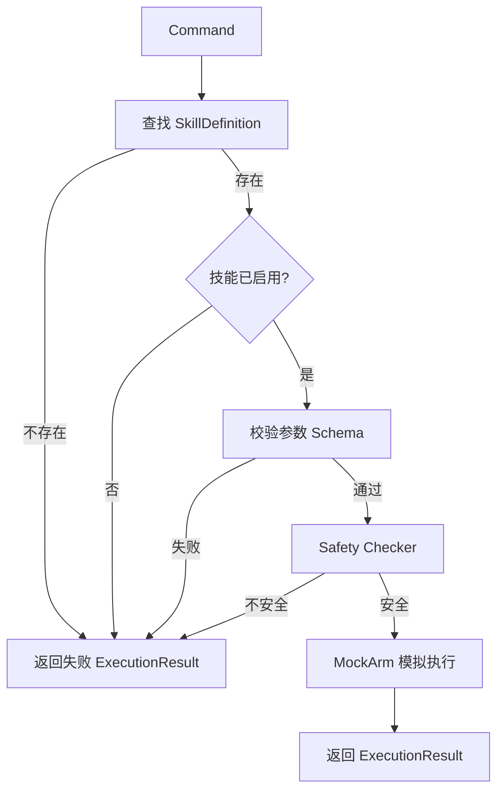

# RosClaw Mini

RosClaw Mini 是一个面向机械臂控制场景的轻量级 Python 原型。项目当前聚焦于一条可验证的结构化命令执行链路：先从技能注册表中查找技能，完成启用状态、参数结构和安全边界检查，再交给模拟机械臂执行。

> 当前阶段：**技能驱动的 Mock 执行链路**。项目不会连接或控制真实机械臂，请勿将当前实现直接用于生产设备。

## 当前能力

已实现并接入主链路的能力：

- `Command`、`SafetyResult`、`ExecutionResult` 等命令数据模型
- 基于 `SkillDefinition` 和 `ParamSpec` 的技能定义
- 内置技能注册、查询及启用状态检查
- 必需参数、参数类型和额外参数校验
- `move_arm` 工作空间安全检查
- Command Gateway 统一编排
- MockArm 模拟执行
- JSON 命令解析和基础结构校验
- 交互式命令行入口
- 核心链路测试

以下目录或文件目前仍是占位骨架，尚未接入运行链路：

- 真实机械臂 Adapter、运动学与 ROS 2
- Web API 与前端页面
- LLM 客户端、Prompt 和自然语言模型调用
- RAG、状态机、结构化日志和自动评估
- YAML 配置加载
- Docker、运行脚本及 Python 包构建配置

## 执行流程

`run_command(command, skills)` 当前按下面的顺序处理命令：

```text
Command
  -> Skill Registry：技能是否存在
  -> Enabled Check：技能是否启用
  -> Params Validator：参数是否符合技能定义
  -> Safety Checker：命令是否满足安全规则
  -> MockArm：模拟执行
  -> ExecutionResult
```



## 内置技能

| 技能 | 风险等级 | 默认状态 | 参数 | 作用 |
| --- | --- | --- | --- | --- |
| `move_arm` | `medium` | 启用 | `x`、`y`、`z` | 移动到指定笛卡尔坐标 |
| `open_gripper` | `low` | 启用 | 无 | 打开夹爪 |
| `close_gripper` | `low` | 启用 | 无 | 关闭夹爪 |
| `stop` | `low` | 启用 | 无 | 停止当前动作 |

所有内置技能默认不允许额外参数。`move_arm` 的 `x`、`y`、`z` 必须是 `int` 或 `float`，并满足：

```text
0 < x, y, z <= 1
```

`ParamSpec` 中已经保存了 `min_value` 和 `max_value`，但通用参数校验器目前只校验必需字段、精确类型和额外字段；数值范围仍由 `Safety Checker` 针对 `move_arm` 检查。

## 核心数据结构

### Command

| 字段 | 类型 | 说明 |
| --- | --- | --- |
| `command_id` | `str` | 命令唯一标识 |
| `skill_name` | `str` | 要执行的技能名称 |
| `params` | `dict` | 技能参数 |
| `source` | `str` | 命令来源，如 `user` |

### SkillDefinition

| 字段 | 类型 | 说明 |
| --- | --- | --- |
| `skill_name` | `str` | 技能名称 |
| `description` | `str` | 技能说明 |
| `risk_level` | `str` | 风险等级 |
| `enabled` | `bool` | 是否启用 |
| `params_schema` | `dict[str, ParamSpec]` | 参数定义 |
| `allow_extra_params` | `bool` | 是否允许未声明参数，默认 `False` |

### ExecutionResult

| 字段 | 类型 | 说明 |
| --- | --- | --- |
| `command_id` | `str` | 对应的命令 ID |
| `skill_name` | `str` | 技能名称 |
| `success` | `bool` | 是否成功 |
| `message` | `str` | 执行结果或拒绝原因 |

## 环境要求

- Python 3.10 或更高版本
- 当前已接入的主链路只使用 Python 标准库

项目采用 `src/` 布局，但 `pyproject.toml` 和 `requirements.txt` 目前为空，因此尚不能通过常规方式安装。运行命令时需要设置 `PYTHONPATH=src`。

## 快速开始

### 1. 获取项目并进入目录

```bash
cd rosclaw-mini
```

### 2. 创建虚拟环境（可选）

使用 Conda：

```bash
conda create -n rosclaw-mini python=3.10
conda activate rosclaw-mini
```

### 3. 启动交互式入口

```bash
PYTHONPATH=src python3 -m rosclaw_mini.main
```

当前入口接收的是 JSON，不会调用大语言模型。示例输入：

```json
{"skill_name": "move_arm", "params": {"x": 0.5, "y": 0.4, "z": 0.3}}
```

其他可用输入：

```json
{"skill_name": "open_gripper", "params": {}}
{"skill_name": "close_gripper", "params": {}}
{"skill_name": "stop", "params": {}}
```

输入 `exit` 退出程序。每条命令会自动生成 UUID，并以 `ExecutionResult` 输出处理结果。

## Python 调用示例

```python
from rosclaw_mini.command_schema.commands import Command
from rosclaw_mini.gateway.command.gateway import run_command
from rosclaw_mini.skills.registry import BUILTIN_SKILLS

command = Command(
    command_id="cmd-001",
    skill_name="move_arm",
    params={"x": 0.5, "y": 0.4, "z": 0.3},
    source="user",
)

result = run_command(command, BUILTIN_SKILLS)
print(result)
```

预期结果：

```text
ExecutionResult(command_id='cmd-001', skill_name='move_arm', success=True, message='已移动机械臂到指定位置0.5,0.4,0.3')
```

典型失败情况包括：

| 情况 | 示例结果 |
| --- | --- |
| 技能不存在 | `技能不存在: destroy_arm` |
| 技能未启用 | `技能未启用: move_arm` |
| 缺少参数 | `缺少必需参数: z` |
| 包含额外参数 | `不允许额外参数: speed` |
| 坐标越界 | `UnsafeCommand, Invalid x: 2.0` |

## JSON 命令解析

`parse_json_command()` 负责把 JSON 字符串转换为 `Command`。输入对象必须同时包含：

- 非空字符串 `skill_name`
- 字典类型 `params`

```python
from rosclaw_mini.llm.command_parser import parse_json_command

command = parse_json_command(
    '{"skill_name": "open_gripper", "params": {}}',
    "cmd-002",
)
```

非法 JSON 会抛出 `json.JSONDecodeError`，结构不合法会抛出 `ValueError`。该模块目前只是确定性解析器，并未接入 LLM 客户端。

## 测试

安装 `pytest` 后可运行完整测试集：

```bash
PYTHONPATH=src python3 -m pytest -q
```

两个脚本式测试也可以直接运行，无需 pytest：

```bash
PYTHONPATH=src python3 -m tests.test_safety_checker
PYTHONPATH=src python3 -m tests.test_mock_arm
```

当前测试覆盖：

- 命令与执行结果数据模型
- 技能定义和注册表查询
- JSON 命令解析及非法输入
- 参数 schema 校验
- 安全坐标与越界拦截
- 未知技能、禁用技能和正常执行
- MockArm 的成功与失败分支

## 项目结构

```text
rosclaw-mini/
├── README.md
├── pyproject.toml                 # 当前为空，待补充包配置
├── requirements.txt              # 当前为空，主链路无第三方依赖
├── configs/                       # YAML 配置占位
├── docs/
│   └── arm_actions.md             # 机械臂动作接口设计文档
├── scripts/                       # 运行脚本占位
├── src/rosclaw_mini/
│   ├── main.py                    # JSON 命令交互入口
│   ├── command_schema/
│   │   ├── commands.py            # 命令、安全和执行结果模型
│   │   └── schemas.py             # 早期服务网关模型
│   ├── skills/
│   │   ├── base.py                # SkillDefinition / ParamSpec
│   │   ├── arm_skills.py          # 内置机械臂技能定义
│   │   ├── registry.py            # 技能注册表
│   │   └── validator.py           # 通用参数校验
│   ├── gateway/command/gateway.py # 命令执行编排
│   ├── safety/checker.py          # 安全规则
│   ├── arm/mock_arm.py            # 模拟机械臂执行器
│   ├── llm/
│   │   ├── command_parser.py      # 文本/JSON 确定性解析
│   │   └── command_validator.py   # JSON 数据结构校验
│   ├── evaluation/                # 占位
│   ├── logging/                   # 占位
│   ├── rag/                       # 占位
│   ├── ros2/                      # 占位
│   ├── state/                     # 占位
│   └── web/                       # 占位
└── tests/
```

## 当前边界与注意事项

1. **只支持模拟执行**：`MockArm` 返回预设结果，不提供真实运动、碰撞检测或硬件反馈。
2. **技能 schema 与安全策略仍有重复**：`move_arm` 的范围既记录在 `ParamSpec` 中，又硬编码在 `Safety Checker` 中，但通用校验器尚未消费范围字段。
3. **配置尚未生效**：`configs/*.yaml` 为空，技能和安全限制都定义在 Python 源码中。
4. **风险等级仅作元数据**：Gateway 目前不会根据 `risk_level` 动态授权或执行额外策略。
5. **LLM 尚未接入**：主入口要求用户提供结构化 JSON；`llm/client.py` 和 `llm/prompts.py` 仍为空。
6. **包配置尚未完成**：当前依赖 `PYTHONPATH=src` 运行，pytest 也未写入项目依赖。
7. **早期服务网关模型未接入主链路**：`command_schema/schemas.py` 和 `notebooks/` 中的内容属于探索性原型。

## 建议的下一步

1. 让 `validate_skill_params()` 正式执行 `min_value` / `max_value` 校验，减少规则重复
2. 补齐 `pyproject.toml`、开发依赖和 pytest 配置
3. 将技能开关与安全边界迁移到 YAML 配置
4. 抽象执行器接口，让 Gateway 可注入 MockArm 或真实 Adapter
5. 增加结构化日志、命令状态跟踪和更多边界测试
6. 在安全链路稳定后接入 ROS 2、Web API 和 LLM
