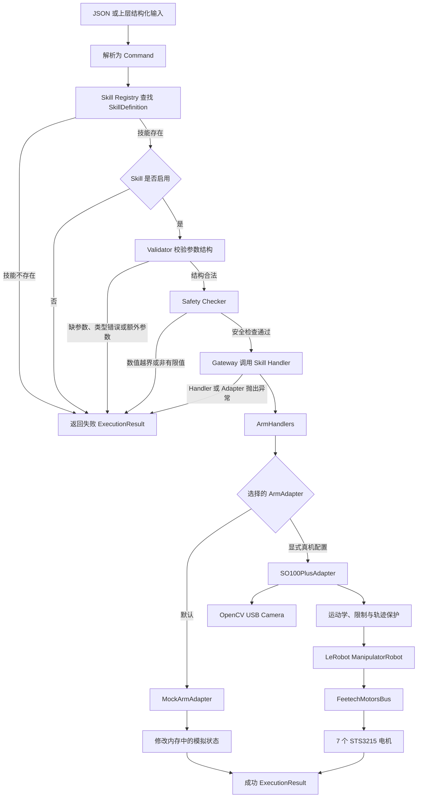

# RosClaw Mini

RosClaw Mini 是一个面向机械臂控制场景的轻量级 Python 原型。项目的核心目标是：
让上层命令先经过结构校验、技能查询和安全检查，再通过统一的机械臂接口执行，
避免业务代码直接操作厂商驱动或电机寄存器。

当前仓库同时包含两条后端：

- `MockArmAdapter`：默认后端，只修改内存状态，不连接真实硬件；
- `SO100PlusAdapter`：已经接入 SO-100 Plus 单臂、Feetech 电机、
  运动学、夹爪、运行遥测和 USB 摄像头。

> `main.py` 目前仍固定使用 Mock 后端。普通启动命令和默认 `pytest`
> 不会自动连接、上力或移动真实机械臂。真机只能通过需要显式风险确认参数的
> 手动脚本执行。本项目仍处于教学和原型阶段，不适用于无人值守或生产环境。

## 目录

- [项目定位](#项目定位)
- [当前完成状态](#当前完成状态)
- [整体架构和思维导图](#整体架构和思维导图)
- [一条命令如何执行](#一条命令如何执行)
- [核心数据结构](#核心数据结构)
- [内置 Skill](#内置-skill)
- [ArmAdapter 统一硬件接口](#armadapter-统一硬件接口)
- [Mock 后端](#mock-后端)
- [SO-100 Plus 真机后端](#so-100-plus-真机后端)
- [`move_to(x, y, z)` 的含义](#move_tox-y-z-的含义)
- [运动限制和运行保护](#运动限制和运行保护)
- [夹爪、停止和关闭力矩](#夹爪停止和关闭力矩)
- [摄像头接入](#摄像头接入)
- [快速开始](#快速开始)
- [Python 调用示例](#python-调用示例)
- [测试](#测试)
- [手动真机验证](#手动真机验证)
- [已经完成的真机验证](#已经完成的真机验证)
- [项目结构](#项目结构)
- [当前边界](#当前边界)
- [建议的下一步](#建议的下一步)

## 项目定位

RosClaw Mini 希望解决的是“上层命令如何安全地落到机械臂动作”这个问题。
项目把不同职责拆成独立层：

1. `Command` 描述用户想执行什么；
2. Skill Registry 判断这个动作是否存在、是否启用；
3. Validator 检查参数结构；
4. Safety Checker 根据 Skill 自己的 `ParamSpec` 检查数值边界；
5. Gateway 编排整个流程并统一处理错误；
6. ArmHandlers 把业务 Skill 映射为机械臂原子动作；
7. ArmAdapter 隔离 Mock、SO-100 Plus 或未来其他硬件的差异；
8. 所有业务执行都返回统一的 `ExecutionResult`。

项目当前不是一个完整的通用机器人平台。以下能力仍未接入主执行链路：

- LLM 自然语言规划；
- RAG 知识检索；
- ROS 2 节点、Topic、Service 和 Action；
- Web API 与前端；
- 视觉识别和视觉闭环控制；
- 碰撞检测和避障；
- 状态持久化、完整审计日志和任务状态机。

仓库中已经为其中一部分能力保留了目录或空文件，但“文件存在”不代表功能已经完成。

## 当前完成状态

| 模块 | 当前状态 | 是否进入默认入口 |
| --- | --- | --- |
| Command / ExecutionResult 数据模型 | 已实现 | 是 |
| SkillDefinition / ParamSpec | 已实现 | 是 |
| Skill Registry | 已实现 | 是 |
| 参数 Validator | 已实现 | 是 |
| Safety Checker | 已实现 | 是 |
| Command Gateway | 已实现 | 是 |
| ArmHandlers | 已实现 | 是 |
| ArmAdapter 抽象接口 | 已实现 | 是 |
| MockArmAdapter | 已实现 | 是，默认后端 |
| SO100PlusAdapter | 已实现并进行过真机验证 | 否，需手动脚本 |
| SO-100 Plus FK / IK / TCP | 已实现并进行过局部验证 | 否 |
| SO-100 Plus 固定姿态正式工作空间 | 真机边界代表点全部测试；登记内缩后的 `12 × 6 × 12 cm` 可达长方体 | 可通过专用 Skill 构造函数接入 |
| SO-100 Plus 外层仿真候选框 | 百万姿态扫描完成；外层仍只属于仿真候选 | 否 |
| SO-100 Plus 摄像头接口 | 软件接入完成 | 否，真实单帧尚未验证 |
| 全局实机 XYZ 工作空间 | 尚未认证 | 否 |
| LLM / RAG / Web / ROS 2 | 尚未接入 | 否 |

## 整体架构和思维导图

下面的图恢复了原 README 的 Mermaid 流程图，并根据当前代码更新了
Validator、ArmHandlers、ArmAdapter 和真实机械臂分支。



从分层角度看，项目结构是：

```text
输入层
└── JSON / 未来 LLM、Web、ROS 2

命令层
└── Command / ExecutionResult

技能与安全层
├── Skill Registry
├── Validator
├── Safety Checker
└── WorkspaceLimits / JointLimits

编排层
├── Command Gateway
└── ArmHandlers

统一硬件接口
└── ArmAdapter
    ├── MockArmAdapter
    └── SO100PlusAdapter
        ├── SO100PlusKinematics
        ├── LeRobot ManipulatorRobot
        ├── FeetechMotorsBus
        └── OpenCV Camera
```

## 一条命令如何执行

调用 `run_command(command, skills)` 后，Gateway 严格按照下面的顺序处理：

### 1. 查找 Skill

Gateway 根据 `command.skill_name` 在传入的 Skill 字典中查找
`SkillDefinition`。

如果不存在，立即返回：

```text
技能不存在: <skill_name>
```

### 2. 检查 Skill 是否启用

Skill 可以存在但处于 `enabled=False` 状态。例如，调用方没有提供明确的
`WorkspaceLimits` 时，`move_arm` 会失败关闭，而不是使用一个猜测的实机范围。

失败结果示例：

```text
技能未启用: move_arm
```

### 3. Validator 检查参数结构

`validate_skill_params()` 负责检查：

- 所有必需参数是否存在；
- 参数的精确 Python 类型是否允许；
- 是否包含未声明的额外参数。

例如，`move_arm` 需要 `x`、`y`、`z`，并且默认不接受 `speed` 之类的
额外字段。

### 4. Safety Checker 检查数值安全边界

`check_command()` 再次防御性检查命令与 Skill 是否匹配，并读取
`ParamSpec` 中的：

- `min_value`；
- `max_value`；
- `min_inclusive`；
- `max_inclusive`。

它也会拒绝 `NaN`、正无穷和负无穷。Checker 不再把
`0 < x,y,z <= 1` 写死成所有机械臂的通用范围。

### 5. 调用 Handler

通过所有检查后，Gateway 调用 `skill.handler(command)`。

机械臂 Skill 当前由 `ArmHandlers` 处理。例如：

```text
move_arm Command
→ ArmHandlers.move_arm()
→ adapter.move_to(x, y, z)
```

Handler 不知道底层是 Mock 还是真实机械臂。

### 6. 返回统一结果

正常完成时，Handler 返回成功的 `ExecutionResult`。如果 Handler 或
Adapter 抛出异常，Gateway 会捕获异常并转换为：

```text
技能执行失败: <具体错误>
```

这样，上层不需要直接处理 LeRobot、串口或运动学异常类型。

## 核心数据结构

### Command

`Command` 表示一条准备交给 Gateway 的结构化命令。

| 字段 | 类型 | 说明 |
| --- | --- | --- |
| `command_id` | `str` | 命令唯一标识，用于追踪执行 |
| `skill_name` | `str` | 要调用的 Skill 名称 |
| `params` | `dict` | Skill 参数 |
| `source` | `str` | 命令来源，例如 `user`、`system` |

示例：

```python
Command(
    command_id="cmd-001",
    skill_name="move_arm",
    params={"x": 0.30, "y": 0.00, "z": 0.20},
    source="user",
)
```

### SafetyResult

`SafetyResult` 是 Safety Checker 的输出。

| 字段 | 类型 | 说明 |
| --- | --- | --- |
| `command_id` | `str` | 对应的命令 ID |
| `is_safe` | `bool` | 是否允许继续执行 |
| `risk_level` | `str` | Skill 风险等级或拒绝后的 `high` |
| `reason` | `str` | 检查通过说明或拒绝原因 |

### ExecutionResult

`ExecutionResult` 是 Gateway 对外返回的统一结果。

| 字段 | 类型 | 说明 |
| --- | --- | --- |
| `command_id` | `str` | 对应的命令 ID |
| `skill_name` | `str` | 实际处理的 Skill |
| `success` | `bool` | 是否成功 |
| `message` | `str` | 成功说明或失败原因 |

### ParamSpec

`ParamSpec` 描述一个 Skill 参数可以接受什么。

| 字段 | 类型 | 说明 |
| --- | --- | --- |
| `accepted_types` | `tuple[type, ...]` | 允许的精确类型 |
| `required` | `bool` | 是否必需，默认 `True` |
| `min_value` | `float \| None` | 可选最小值 |
| `max_value` | `float \| None` | 可选最大值 |
| `min_inclusive` | `bool` | 是否包含最小值 |
| `max_inclusive` | `bool` | 是否包含最大值 |

### SkillDefinition

`SkillDefinition` 把 Skill 的说明、参数和执行函数放在一起。

| 字段 | 类型 | 说明 |
| --- | --- | --- |
| `skill_name` | `str` | Skill 唯一名称 |
| `description` | `str` | 功能说明 |
| `risk_level` | `str` | 当前风险等级元数据 |
| `enabled` | `bool` | 是否允许 Gateway 调用 |
| `params_schema` | `dict[str, ParamSpec]` | 参数定义 |
| `handler` | `Callable` | 通过检查后调用的处理函数 |
| `allow_extra_params` | `bool` | 是否接受额外参数，默认 `False` |

风险等级目前会进入 `SafetyResult`，但还没有独立的用户授权策略或动态审批系统。

## 内置 Skill

`build_arm_skills(adapter, workspace_limits)` 当前创建五个 Skill：

| Skill | 风险等级 | 参数 | Adapter 原子动作 | 默认状态 |
| --- | --- | --- | --- | --- |
| `move_arm` | `medium` | `x`, `y`, `z` | `move_to(x, y, z)` | 只有传入工作空间时启用 |
| `open_gripper` | `low` | 无 | `open_gripper()` | 启用 |
| `close_gripper` | `low` | 无 | `close_gripper()` | 启用 |
| `stop` | `low` | 无 | `stop()` | 启用 |
| `disable_torque` | `medium` | 无 | `disable_torque()` | 启用 |

`move_arm` 的参数单位由 Adapter 接口统一定义为米，表示机械臂底座坐标系中的
绝对 TCP 坐标。

复杂任务以后可以由多个原子动作组成。例如，一个 `pick` Skill 可以编排：

```text
open_gripper()
→ move_to(物体上方)
→ move_to(抓取位置)
→ close_gripper()
→ move_to(抬起位置)
```

当前仓库没有把这个示例实现成正式 `pick` Skill。

## ArmAdapter 统一硬件接口

`ArmAdapter` 是所有机械臂后端必须实现的抽象接口。

| 接口 | 作用 |
| --- | --- |
| `is_connected` | 查询连接状态 |
| `connect()` | 建立后端连接 |
| `disconnect()` | 关闭后端通信 |
| `move_to(x, y, z)` | 移动夹爪 TCP 到绝对位置 |
| `open_gripper()` | 打开夹爪 |
| `close_gripper()` | 关闭夹爪 |
| `stop()` | 停止剩余动作并保持当前位置 |
| `disable_torque()` | 关闭关节力矩 |

Adapter 只负责统一硬件动作，不负责：

- 解析 JSON；
- 查找 Skill；
- 生成 `ExecutionResult`；
- 决定业务任务的动作顺序；
- 执行 LLM 或 RAG；
- 判断用户是否有操作权限。

这种分层使 `ArmHandlers` 可以同时绑定 Mock 或真实后端，而不需要复制业务逻辑。

## Mock 后端

`MockArmAdapter` 不会导入真实机械臂驱动，也不会访问 `/dev` 设备。它通过修改
内存属性模拟操作：

| 动作 | Mock 行为 |
| --- | --- |
| `connect()` | 把连接状态和模拟力矩设为开启 |
| `disconnect()` | 把连接状态和模拟力矩设为关闭 |
| `move_to()` | 记录新的 `(x, y, z)` |
| `open_gripper()` | 把夹爪状态记录为打开 |
| `close_gripper()` | 把夹爪状态记录为关闭 |
| `stop()` | 把停止状态记录为 `True` |
| `disable_torque()` | 把模拟力矩状态设为关闭 |

它适合验证命令链路、失败分支和上层逻辑，但不能代表真实机械臂的：

- 可达性；
- 运动精度；
- 碰撞情况；
- 电机负载；
- 温度；
- 回差或重力下垂。

## SO-100 Plus 真机后端

### 已确认的设备配置

| 项目 | 当前配置 |
| --- | --- |
| 型号 | SO-100 Plus 单臂 |
| follower | `right` |
| 稳定串口别名 | `/dev/lerobot_right` |
| 校准文件 | `right_follower.json` |
| 校准目录 | `lerobot-joycon_plus/.cache/calibration/so100_plus` |
| 电机型号 | 7 个 STS3215 |
| 电机总线 | FeetechMotorsBus |
| LeRobot 包装 | ManipulatorRobot |

这些值属于当前这台 `right_follower`。其他 SO-100、SO-100 Plus 或其他校准文件
不能直接假设使用相同的角度和保护参数。

### 电机映射

| ID | LeRobot 名称 | 作用 |
| ---: | --- | --- |
| 1 | `shoulder_rotation_joint` | 底座旋转 |
| 2 | `shoulder_pitch_joint` | 肩关节俯仰 |
| 3 | `ellbow_joint` | 肘关节，名称沿用源项目拼写 |
| 4 | `wrist_pitch_joint` | 腕部俯仰 |
| 5 | `wrist_jaw_joint` | 腕部偏航 |
| 6 | `wrist_roll_joint` | 腕部滚转 |
| 7 | `gripper_joint` | 夹爪开合 |

前六个关节参与 FK 和 IK，第七个电机由夹爪动作单独控制。

### 连接前预检

`SO100PlusRobotConfig` 根据显式配置构造机器人。Factory 在导入 LeRobot
或打开串口前检查：

- follower 名称是否是简单标识符；
- 串口是否存在且为字符设备；
- 校准 JSON 是否存在、可读且能解析；
- `motor_names` 是否与七个电机的名称和顺序完全一致；
- 每个校准向量是否恰好包含七个值。

校准文件缺失或不匹配时会直接失败，不允许 LeRobot 自动进入重新校准流程。

### 连接不是只读操作

`ManipulatorRobot.connect()` 会打开串口、加载校准、设置运行配置并启用力矩。
`SO100PlusAdapter.connect()` 还会：

1. 同步实测位置和目标位置，降低旧目标导致跳动的风险；
2. 写入并回读关节 P 参数；
3. 写入运行时加速度；
4. 关闭电机 EEPROM 写锁；后续只有显式 PID 调参接口才会短暂解锁；
5. 读取电压、电流、负载和温度。

摄像头不属于机械臂连接前置条件。`connect()` 和 `disconnect()` 不会
检查、连接或关闭摄像头。

因此，“只看一下是否能连接”也属于会改变机械臂状态的真机操作。

## `move_to(x, y, z)` 的含义

### 单位和目标类型

- `x`、`y`、`z` 的单位都是米；
- 三个值是绝对坐标，不是相对移动距离；
- 所有值必须是有限数值；
- 目标必须位于调用方显式传入的 `WorkspaceLimits` 内。

如果需要从当前位置“向上 10 cm”，脚本必须先读取当前 TCP，再把目标计算为：

```text
(current_x, current_y, current_z + 0.10)
```

而不是直接调用 `move_to(0, 0, 0.10)`。

### 坐标系

坐标使用 `lerobot_kinematics` SO-100 Plus 模型的底座固定坐标系：

- 原点在运动学模型的机械臂底座原点；
- `+Z` 是模型向上方向；
- `+X` 是模型零位时机械臂主要向外伸展的方向；
- `+Y` 由右手坐标系确定，是底座水平侧向。

底座在桌面上的安装方向会改变这些轴相对于操作者和房间的方向。

### TCP 是哪个点

`move_to()` 控制的是两根夹指最前端内侧之间的夹持中心，也就是
TCP（Tool Center Point），不是：

- 腕关节中心；
- 夹爪电机轴；
- 第六关节法兰原点；
- 摄像头光心。

第六关节运动学末端到 TCP 的固定工具局部偏移是：

```text
(0.10127, -0.00690, 0.00118) m
```

### 姿态

当前接口只接收位置，不接收 roll、pitch、yaw。IK 会读取当前 TCP 姿态，
保持当前旋转矩阵，只改变 TCP 的位置。因此它的完整语义是：

```text
保持当前夹爪姿态，把 TCP 移动到新的绝对 x/y/z
```

### 规划与执行

一次真实 `move_to()` 大致经过：

```text
读取当前 6 个关节角
→ 驱动角转换为模型弧度
→ FK 计算当前 TCP
→ 检查目标工作空间
→ IK 求解目标关节角
→ FK 复算目标位置和姿态误差
→ 检查关节范围和规划步长
→ 生成关节路径
→ 30 Hz 余弦缓入缓出发送目标
→ 持续读取跟踪误差和遥测
→ 最终检查关节误差与 TCP 误差
```

规划失败、IK 失败、误差超限或遥测触发保护时，Adapter 会抛出异常，
Gateway 会把它转换成失败的 `ExecutionResult`。

## 运动限制和运行保护

### 显式工作空间

`WorkspaceLimits` 保存 TCP 的三轴闭区间，单位统一为米：

```python
WorkspaceLimits(
    x=AxisLimits(x_min, x_max),
    y=AxisLimits(y_min, y_max),
    z=AxisLimits(z_min, z_max),
)
```

当前 `right_follower` 已登记一个真机测试后的固定姿态正式工作空间：

```text
X:  0.313571423 .. 0.433571423 m
Y: -0.041185494 .. 0.018814506 m
Z:  0.179328483 .. 0.299328483 m
```

它是原 `14 × 8 × 14 cm` 仿真候选框每个面内缩 `1 cm` 后的
`12 × 6 × 12 cm` 长方体。14 个边界代表点均已执行真机运动，其中
12 个满足 `12 mm` 到位门槛，2 个安全到达但误差分别约为
`24.800 mm` 和 `14.780 mm`。因此它的正式含义是“当前工位的可达目标
范围”，不是“全域保证 12 mm 精度”。

代码常量为
`SO100_PLUS_RIGHT_FOLLOWER_WORKSPACE_LIMITS`。它只适用于当前
`right_follower`、校准文件、底座、无障碍工位和 JoyCon 初始 TCP 姿态
附近；不是任意姿态或其他机械臂的全局 XYZ 工作空间。

### 关节限制

`JointLimits` 保存：

- 六个模型关节名称；
- 每个关节的弧度下限；
- 每个关节的弧度上限；
- 每个规划内部步骤允许的最大变化。

第三方模型关节范围用于拒绝明显异常的 IK 解，但不等于所有关节都完成了
当前真机安装条件下的物理边界认证。

目前唯一由用户在关闭力矩时手动选择过的实机范围是底座旋转关节：

```text
LeRobot 校准后驱动角：[-19.599609°, 31.201172°]
```

它只适用于当前底座和当前 `right_follower` 校准。

### 已保存的实机运行配置

`SO100PlusRealHardwareProfile` 保存了上一轮真机验证采用的配置：

| 配置 | 当前值 | 用途 |
| --- | ---: | --- |
| 其他电机 P | 16 | 连接时写入 |
| 肘关节 P | 64 | 改善负载下跟踪 |
| 腕部俯仰 P | 24 | 减少目标附近的稳态误差 |
| 运行时加速度 | 35 | 只写 RAM |
| 夹爪单步 | 10° | 避免一次大幅开合 |
| 夹爪步间等待 | 2.5 s | 等待位置反馈 |
| 夹爪负载上限 | 300 | 夹持堵转保护 |
| 夹爪位置容差 | 3° | 判断夹爪是否到位 |
| 最终关节容差 | 3.0° | 判断六关节是否到位 |
| 最终 TCP 容差 | 12 mm | FK 复算误差保护 |
| 手臂普通过载上限 | 450 | 同一电机连续两次达到时停止 |
| 手臂紧急负载上限 | 700 | 单次达到时立即停止 |
| 普通过温上限 | 60°C | 同一电机连续两次达到时停止 |
| 紧急温度上限 | 70°C | 单次达到时立即停止 |
| 流式频率 | 30 Hz | 轨迹下发频率 |
| 最大关节速度 | 20°/s | 限制流式运动速度 |
| 跟踪误差上限 | 5° | 超限时停止剩余轨迹 |
| 遥测间隔 | 0.25 s | 记录运行状态 |
| 最终到位超时 | 8 s | 防止无限等待 |
| 最终稳定观察 | 0.75 s | 进入 3°后继续观察再检查 TCP |

最终稳定观察会记录六个关节的逐样本位置和峰峰值，并复算每个样本的
TCP。真机 JSONL 日志保存 TCP 的 XYZ 最小值、最大值和平均值；最终
12 mm 检查使用稳定窗口的最新位置。30 Hz 只让流式目标更细密，最大
关节速度仍保持 20°/s。

腕部俯仰 P=24 已完成一次真机写入和回读验证。收纳脱离与 JoyCon
初始工作姿态通过，但第一个候选框目标的最终腕部误差为 `1.547°`，
比当时的 `1.5°` 门槛多 `0.047°`，脚本因此安全停止并关闭力矩。
本次最高温度 `39°C`、最高负载 `272/300`；P=24 保留。用户随后
当时确认将关节容差调整为 `2.0°`，TCP 容差继续保持 `6 mm`；
这是后续边界验收前的历史配置。

使用 `2.0° / 6 mm` 重新验证后，第一个候选点不再因关节误差停止，
但最终 TCP 误差为 `10.755 mm`，超过 6 mm 门槛，脚本再次安全停止
并关闭力矩。本次最高温度 `40°C`、最高负载 `256/300`。当前瓶颈
是多个关节各自小于 2°、但可以重复出现的稳态滞后，它们组合后形成
更大的 TCP 误差；候选框仍未完成整套实机认证。

30 Hz 加 0.75 秒稳定观察的下一次真机记录显示：收纳脱离阶段最大
关节峰峰值为 `0.352°`、TCP 单轴最大波动为 `1.061 mm`；JoyCon
初始工作姿态和第一个候选点的稳定关节波动均为 `0.000°`。第一个
候选点的稳定 TCP 误差仍为 `11.907 mm`，其中 Z 方向低
`11.571 mm`；底座、肘和腕俯仰分别稳定滞后约 `0.769°`、
`1.099°` 和 `1.677°`。本次最高温度 `39°C`、最高负载
`256/300`。因此约
1.2 cm 的误差不是持续抖动或检测过早造成的。

### 有限轮 PID 与残差补偿

`scripts/tune_so100_plus_pid.py` 把后续试验限制为固定上限，不会无限
循环搜索。它保持已经验证过的 P（底座 16、肘 64、腕俯仰 24），最多
依次比较五组 I/D：

```text
(I=0, D=0)
→ (I=0, D=16)
→ (I=0, D=32)
→ (I=1, D=前三组最佳 D)
→ (I=2, D=前三组最佳 D)
```

每组只执行一次“JoyCon 初始姿态 → near_internal → 初始姿态”往返。
任一结果同时满足 TCP 误差不超过 6 mm、TCP 单轴稳定波动不超过
2 mm 时提前结束。否则从五组中选择综合误差和波动最小的一组；若其
六关节残差均不超过 2°，最多再做一次反向残差补偿。补偿没有改善就
停止，不再继续试。

PID 寄存器位于 EEPROM。Adapter 写入前保持当前位置，只解锁指定电机，
每个电机写完立即重新上锁并读回核对。脚本仍保留 5° 跟踪误差、
夹爪 300 负载、手臂 450 连续/700 紧急负载、60°C 连续过温确认、
70°C 紧急温度、工作空间、关节范围和 MuJoCo 路径检查；异常时恢复
本次调参前的 PID 基线并关闭力矩。

脚本只把每组参数、稳定样本、负载、温度、评分和一次补偿结果写到
JSONL，不会自行修改正式配置。最终又用完全相同的六关节目标比较了
`I=2/D=16` 和 `I=2/D=32`：

| 配置 | 最终 TCP 误差 | TCP 单轴稳定波动 | 最高负载 | 温度 |
| --- | ---: | ---: | ---: | ---: |
| I=2、D=16 | 8.583 mm | 3.652 mm | 260 | 39°C |
| I=2、D=32 | 7.396 mm | 0.291 mm | 267 | 39°C |

因此正式保存 `I=2、D=32`。它应用于底座旋转、肘和腕俯仰三个主要
跟踪关节；P 分别保持 `16、64、24`，其余手臂关节保持 `16/0/0`。
这个固定目标的 7.396 mm 仍高于 6 mm 门槛，所以它是当前两组中的
最佳实机配置，不等于已经证明所有目标都达到 6 mm。

旧版 LeRobot 连接预设会先写回 `P=16、I=0、D=0` 并打开 EEPROM
写锁。`SO100PlusAdapter.connect()` 随后先保持实测位置、统一上锁，
只恢复数值不同的正式 PID，逐个重新上锁并回读核对。因此新的 PID
会在后续每次 Adapter 连接时恢复。

运行期间会记录或检查：

- `Present_Position`；
- `Present_Voltage`；
- `Present_Current`；
- `Present_Load`；
- `Present_Temperature`。

这些值是当前教学版机械臂的实测运行配置，不是厂商精度或安全等级声明。

## 夹爪、停止和关闭力矩

### `open_gripper()`

- 目标角度：60°；
- 每次最多变化 10°；
- 每一步读取位置和负载；
- 偏差或负载超限时保持实测位置并报错。

### `close_gripper()`

- 目标角度：-5°；
- 使用与打开相同的分步、反馈和负载保护。

### `stop()`

`stop()` 会读取所有电机的 `Present_Position`，再写回 `Goal_Position`。
它的含义是取消剩余轨迹并保持当前位置，力矩仍然开启。

### `disable_torque()`

普通 `disable_torque()` 会先读取六个手臂关节，确认机械臂处于本机
已验证的 `follower_rest` 容差内，然后才写入 `Torque_Enable = 0`，
确认七个电机力矩均关闭，并保持 EEPROM 写锁关闭。当前位置不满足
Rest 条件时会拒绝普通力矩释放。

只有过温、过载、碰撞、人工急停，或者受控收纳本身失败时，调用方才可
显式使用 `disable_torque(emergency=True)`。紧急释放会记录独立遥测
阶段，并要求操作者托住机械臂。两种模式都不会重写 P/I/D。

### `disconnect()`

`disconnect()` 只关闭 LeRobot 和串口通信，不保证关闭力矩，也不是急停。

三者的区别：

| 操作 | 是否保持力矩 | 机械效果 |
| --- | --- | --- |
| `stop()` | 是 | 停止轨迹并保持当前位置 |
| `disable_torque()` | 否 | 机械臂变软，可能下落 |
| `disconnect()` | 不保证改变 | 只断开通信 |

真机脚本通常采用：

```text
stop()
→ 受控返回并验证 follower_rest
→ disable_torque()
→ disconnect()
```

普通定位误差会先尝试沿已经检查的路径收纳。过温、过载、碰撞或人工
急停不会为了收纳而继续运动，而是提示操作者托住机械臂并走显式紧急
释放。软件动作不能替代物理断电或独立硬件急停。

## 摄像头接入

已实现：

- `SO100PlusCameraConfig`；
- `create_so100_plus_cameras()`；
- 摄像头配置预检；
- 独立的 `connect_cameras()` 和 `disconnect_cameras()`；
- `capture_camera_images()`。

当前预期参数：

| 项目 | 值 |
| --- | --- |
| 摄像头名称 | `right` |
| 后端 | LeRobot OpenCVCamera |
| 图像格式 | RGB |
| 分辨率 | 640 × 480 |
| 帧率 | 60 FPS |
| 输出键 | `observation.images.right` |
| 数组布局 | HWC，`(480, 640, 3)` |

摄像头应使用稳定的 `/dev/v4l/by-id/...-video-index0` 路径或单独的
udev 别名，不应把实际设备序列号提交到公共仓库。

机械臂和摄像头生命周期完全独立：

```python
adapter.connect()          # 只连接机械臂；不要求电脑插摄像头

# 只有需要视觉时才调用：
adapter.connect_cameras()
images = adapter.capture_camera_images()
adapter.disconnect_cameras()

adapter.disconnect()       # 只断开机械臂
```

两组接口可以按任意顺序调用。摄像头连接失败只会回滚本次摄像头连接，
不会连接、断开或改变机械臂力矩；机械臂断开后，已连接的摄像头也可继续
抓图。完全不需要摄像头时不要创建摄像头配置即可。目前 FakeCamera
独立生命周期测试已通过，但真实摄像头的单帧抓取尚未执行。

## 快速开始

### 环境要求

- 推荐 Python 3.10；
- 当前使用的 Conda 环境名为 `rosclaw-mini-py310`；
- 默认 Mock 主链路主要使用 Python 标准库；
- 真机需要 LeRobot、Feetech 驱动、`lerobot_kinematics`、NumPy 和 OpenCV；
- `pyproject.toml` 和 `requirements.txt` 尚未完整声明全部真机依赖。

### 1. 进入仓库

```bash
cd rosclaw-mini
```

### 2. 激活环境

```bash
conda activate rosclaw-mini-py310
```

### 3. 启动默认 Mock 入口

```bash
PYTHONPATH=src python -m rosclaw_mini.main
```

该入口不会自动调用 LLM。它要求输入结构化 JSON。

移动示例：

```json
{"skill_name": "move_arm", "params": {"x": 0.5, "y": 0.4, "z": 0.3}}
```

其他示例：

```json
{"skill_name": "open_gripper", "params": {}}
{"skill_name": "close_gripper", "params": {}}
{"skill_name": "stop", "params": {}}
{"skill_name": "disable_torque", "params": {}}
```

输入：

```text
exit
```

即可退出。

### 常见输入错误

| 输入问题 | 结果 |
| --- | --- |
| 不是合法 JSON | 输出“LLM 输入的内容不是合法 JSON” |
| JSON 缺少必需结构 | 输出“JSON 合法，但 Command 数据结构不合法” |
| Skill 不存在 | 返回失败 `ExecutionResult` |
| Skill 未启用 | 返回失败 `ExecutionResult` |
| 缺少参数 | Validator 拒绝 |
| 参数越界 | Safety Checker 拒绝 |
| Adapter 异常 | Gateway 转换为失败结果 |

## Python 调用示例

下面的示例构造 Mock Adapter、显式工作空间和 Skill Registry，然后执行一条命令：

```python
from rosclaw_mini.arm.mock_arm import MockArmAdapter
from rosclaw_mini.command_schema.commands import Command
from rosclaw_mini.gateway.command.gateway import run_command
from rosclaw_mini.safety.limits import AxisLimits, WorkspaceLimits
from rosclaw_mini.skills.arm_skills import build_arm_skills

adapter = MockArmAdapter()
adapter.connect()

mock_workspace = WorkspaceLimits(
    x=AxisLimits(-1.0, 1.0),
    y=AxisLimits(-1.0, 1.0),
    z=AxisLimits(-1.0, 1.0),
)

skills = build_arm_skills(
    adapter,
    workspace_limits=mock_workspace,
)

command = Command(
    command_id="cmd-001",
    skill_name="move_arm",
    params={"x": 0.5, "y": 0.4, "z": 0.3},
    source="user",
)

result = run_command(command, skills)
print(result)
print(adapter.position)
```

预期结果的核心字段是：

```text
success=True
adapter.position == (0.5, 0.4, 0.3)
```

如果不向 `build_arm_skills()` 传入 `workspace_limits`，`move_arm`
会处于禁用状态：

```python
skills = build_arm_skills(adapter)
assert skills["move_arm"].enabled is False
```

这是为了防止示例工作空间被误用于真机。

当前 `right_follower` 可以使用专用入口，自动把已登记的正式范围交给
Skill Validator 和 Safety Checker：

```python
from rosclaw_mini.skills.arm_skills import (
    build_so100_plus_right_follower_arm_skills,
)

skills = build_so100_plus_right_follower_arm_skills(adapter)
```

真实 `SO100PlusAdapter` 的运动学限制应使用
`build_so100_plus_right_follower_motion_limits(current_joint_radians)`，
确保 Adapter 与 Skill 使用同一个工作空间。

## 测试

### 运行全部测试

```bash
conda activate rosclaw-mini-py310
python -m pytest -q
```

当前已验证结果：

```text
233 passed
```

### 覆盖范围

默认测试覆盖：

- Command、SafetyResult 和 ExecutionResult；
- SkillDefinition 和 ParamSpec；
- Skill Registry；
- JSON 命令解析；
- Validator；
- Safety Checker；
- Gateway 正常和失败分支；
- ArmHandlers；
- MockArmAdapter；
- WorkspaceLimits、JointLimits 和 MotionLimits；
- SO-100 Plus 驱动角与模型角转换；
- FK、IK、TCP 和轨迹拆分；
- SO-100 Plus factory 和校准预检；
- SO100PlusAdapter 连接、运动、夹爪、停止和关力矩；
- 流式轨迹、跟踪误差和遥测保护；
- 摄像头 factory、独立生命周期和图像形状；
- 百万姿态工作空间扫描器的范围换算、TCP 和碰撞过滤；
- JoyCon 初始工作姿态笛卡尔网格、路径检查和连通候选框；
- 真机脚本的参数保护。

默认测试使用 FakeRobot、FakeBus 和 FakeCamera，不会：

- 打开 `/dev/lerobot_right`；
- 启用真实电机力矩；
- 移动真实机械臂；
- 打开真实 USB 摄像头。

## 手动真机验证

> 本节命令会触碰真实硬件。只有操作者站在机械臂旁边、工作空间清空、
> 能够立即物理断电，并已理解脚本行为时才能执行。

真机脚本位于 `scripts/`，不会被普通 `pytest` 调用。脚本需要显式传入：

- 串口；
- 校准目录；
- follower 名称；
- 对应的 `--acknowledge-...-risk` 参数。

共用环境：

```bash
conda activate rosclaw-mini-py310
export PYTHONPATH=src:lerobot-joycon_plus
export MPLCONFIGDIR=/tmp/matplotlib-rosclaw
```

局部向上 1 cm 的示例：

```bash
python scripts/check_so100_plus_adapter_move_to.py \
  --port /dev/lerobot_right \
  --calibration-dir lerobot-joycon_plus/.cache/calibration/so100_plus \
  --follower-name right \
  --delta-z-cm 1 \
  --runtime-acceleration 35 \
  --single-cartesian-plan \
  --stream-frequency-hz 20 \
  --stream-max-joint-speed-degrees-per-second 20 \
  --acknowledge-move-to-risk
```

这个命令会连接机械臂、启用力矩并产生真实运动。它只验证当前起点附近的一条
局部路径，不代表任意起点都可以安全上移。

候选工作空间的一次性边界套件先运行只读预检：

```bash
python scripts/check_so100_plus_candidate_workspace.py \
  --port /dev/lerobot_right \
  --calibration-dir lerobot-joycon_plus/.cache/calibration/so100_plus \
  --follower-name right \
  --boundary-suite \
  --preflight-only
```

这个模式依次离线复核原有 4 个内部往返点，以及距候选框六个面和八个角
各 `1 cm` 的 14 个代表点；加上最终返回初始姿态，共 19 个检查点。
真机模式会在一次运行中执行相同顺序，最后必须返回并验证
`follower_rest` 才正常断开力矩。只读预检通过并清空现场后，才可把
`--preflight-only` 换为
`--acknowledge-candidate-workspace-motion-risk`。

有限轮 PID 脚本必须先从关闭力矩的 `follower_rest` 运行只读预检：

```bash
python scripts/tune_so100_plus_pid.py \
  --port /dev/lerobot_right \
  --calibration-dir lerobot-joycon_plus/.cache/calibration/so100_plus \
  --follower-name right \
  --preflight-only
```

确认预检、现场路径和 EEPROM 风险后，才把 `--preflight-only` 换成
`--acknowledge-bounded-pid-eprom-tuning-risk`。完整候选、动作上限、
停止条件和硬件命令见
[SO-100 Plus 动作与真机接入文档](docs/arm_actions.md#136-有限轮-pid-自动调参)。

连接、夹爪、`stop()`、底座关节、肘关节 P 和摄像头分别有独立检查脚本。
运行前请阅读：

[SO-100 Plus 动作、坐标、安全配置和真机验证文档](docs/arm_actions.md)

## 已经完成的真机验证

当前这台 `right_follower` 已完成：

- 确认 `/dev/lerobot_right` 指向实际 follower 串口；
- 检查并加载 `right_follower.json`；
- 读取七个电机的真实位置；
- 验证夹爪打开和关闭；
- 验证 `stop()` 保持当前位置；
- 验证 `disable_torque()` 关闭力矩；
- 手动选择安装底座后的底座旋转范围；
- 比较肘关节 P=32、48、64，最终保存 P=64；
- 用固定关节目标完成 I/D 最终 A/B，保存主要跟踪关节 I=2、D=32；
- 多次执行局部 `move_to()`；
- 在 MuJoCo 中分别检查 follower_rest 收纳姿态、JoyCon 初始工作姿态、
  TCP 标记和 +Z 方向；
- 记录运动中的位置、电压、电流、负载和温度。

三次有代表性的 +Z 10 cm 结果：

| 方式 | 实际累计 Z 变化 | 最终 TCP 误差 | 结论 |
| --- | ---: | ---: | --- |
| 分段计划 | 约 9.869 cm | 约 1.742 mm | 通过当次局部验证 |
| 单次笛卡尔计划 | 约 9.743 cm | 约 2.804 mm | 通过当次局部验证 |
| 20 Hz 流式计划 | 约 10.144 cm | 约 8.378 mm | 旧温升规则触发，不计精度通过 |

这些结果只说明当时的起点、姿态、负载和路径能够执行，不证明：

- 整个理论工作空间都安全；
- 任意方向都能达到相同误差；
- 携带物体后仍能达到相同结果；
- 初级教学版机械臂具备工业机械臂精度。

## 项目结构

```text
rosclaw-mini/
├── README.md
├── pyproject.toml                    # pytest 基础配置，依赖尚未补全
├── requirements.txt                 # 尚未完整声明真机依赖
├── configs/
│   ├── default.yaml                 # 当前未接入主链路
│   ├── safety_limits.yaml           # 当前未接入主链路
│   └── skills.yaml                  # 当前未接入主链路
├── docs/
│   ├── arm_actions.md               # SO-100 Plus 详细真机文档
│   ├── so100_plus_simulated_workspace.md
│   │                                # 仿真候选工作空间方法与结果
│   ├── demo_examples.md
│   ├── joint_limits.md
│   ├── safety_rules.md
│   └── workspace_limits.md
├── scripts/
│   ├── check_so100_plus_*.py        # 需要显式风险确认的真机检查
│   ├── simulate_so100_plus_workspace.py
│   │                                # 纯离线工作空间扫描
│   ├── simulate_so100_plus_rest_workspace.py
│   │                                # JoyCon 初始工作姿态 IK 和路径网格
│   ├── check_so100_plus_candidate_workspace.py
│   │                                # 收纳 Rest 展开、内点验证和收回
│   ├── preview_so100_plus_*.py      # 纯计算或离线预览
│   ├── view_so100_plus_mujoco_z.py  # MuJoCo UI 预览
│   └── run_*.py                     # 早期运行脚本
├── src/rosclaw_mini/
│   ├── main.py                      # 默认 Mock JSON 入口
│   ├── command_schema/
│   │   └── commands.py              # Command / SafetyResult / ExecutionResult
│   ├── skills/
│   │   ├── base.py                  # ParamSpec / SkillDefinition
│   │   ├── registry.py              # Skill 查找
│   │   ├── validator.py             # 参数结构校验
│   │   ├── arm_skills.py            # 五个机械臂 Skill
│   │   └── arm_handler.py           # Skill 到 Adapter 的映射
│   ├── safety/
│   │   ├── checker.py               # 通用 ParamSpec 安全检查
│   │   ├── limits.py                # 工作空间和关节限制
│   │   └── risk_policy.py           # 后续风险策略骨架
│   ├── gateway/
│   │   └── command/gateway.py       # 命令执行编排
│   ├── arm/
│   │   ├── base.py                  # ArmAdapter 抽象接口
│   │   ├── mock_arm.py              # Mock 后端
│   │   ├── so100_plus.py            # SO-100 Plus Adapter 和运行保护
│   │   ├── so100_plus_factory.py    # 机器人、校准和摄像头 factory
│   │   ├── so100_plus_diagnostics.py# 遥测与诊断辅助
│   │   └── kinematics.py            # FK、IK、TCP 和轨迹
│   ├── llm/                         # 仅有确定性解析器和占位文件
│   ├── rag/                         # 尚未接入
│   ├── ros2/                        # 尚未接入
│   ├── web/                         # 尚未接入
│   ├── state/                       # 尚未接入
│   ├── logging/                     # 尚未接入
│   └── evaluation/                  # 尚未接入
├── tests/                           # 默认全部为无硬件测试
├── artifacts/
│   ├── so100_plus_workspace/        # 所有姿态仿真点云、报告和图片
│   └── so100_plus_rest_workspace/   # 初始工作姿态网格（旧目录名）
└── lerobot-joycon_plus/             # 独立 LeRobot fork 和校准缓存
```

### 核心文件职责

| 文件 | 职责 |
| --- | --- |
| `src/rosclaw_mini/main.py` | 读取 JSON 并运行默认 Mock 链路 |
| `src/rosclaw_mini/gateway/command/gateway.py` | 编排 Skill 查询、校验、安全检查和执行 |
| `src/rosclaw_mini/skills/arm_skills.py` | 定义五个内置机械臂 Skill |
| `src/rosclaw_mini/skills/arm_handler.py` | 把 Skill 映射到 Adapter 原子动作 |
| `src/rosclaw_mini/safety/checker.py` | 根据 ParamSpec 检查命令 |
| `src/rosclaw_mini/safety/limits.py` | 定义工作空间、关节和运动限制 |
| `src/rosclaw_mini/arm/base.py` | 定义统一 ArmAdapter |
| `src/rosclaw_mini/arm/mock_arm.py` | 提供无硬件 Mock 实现 |
| `src/rosclaw_mini/arm/so100_plus.py` | 提供真实 Adapter、轨迹和运行保护 |
| `src/rosclaw_mini/arm/so100_plus_factory.py` | 创建 Robot/Camera 并进行连接前预检 |
| `src/rosclaw_mini/arm/kinematics.py` | 实现 SO-100 Plus FK、IK、TCP 和路径规划 |
| `docs/arm_actions.md` | 记录真机坐标、安全参数、命令和验证结果 |
| `scripts/simulate_so100_plus_workspace.py` | 离线采样并过滤仿真候选工作空间 |
| `scripts/simulate_so100_plus_rest_workspace.py` | 扫描 JoyCon 初始工作姿态网格和相邻路径（保留旧文件名） |
| `scripts/check_so100_plus_candidate_workspace.py` | 从本机 follower_rest 展开；可验证进出通道、内部点或一次性六面/八角边界套件，并安全收回 |
| `docs/so100_plus_simulated_workspace.md` | 解释工作空间扫描方法、结果和边界 |

## 当前边界

### 真机控制

- `main.py` 还没有 `mock/so100_plus` 后端选择，普通入口不能直接使用真机；
- 已登记固定 JoyCon 初始 TCP 姿态附近的 `12 × 6 × 12 cm` 正式可达工作空间，但任意姿态的全局 XYZ 工作空间仍未认证；
- 已有百万姿态仿真候选点云，但其外包围盒不是安全长方体；
- 原 `14 × 8 × 14 cm` 候选框的14个内缩边界代表点已全部真机测试；正式范围采用内缩后的 `12 × 6 × 12 cm`，其中两个位置不保证 `12 mm` 精度；
- 除底座旋转外，其余关节尚未逐一完成物理边界认证；
- `move_to()` 只保持当前姿态，不支持显式 roll/pitch/yaw；
- `SO100PlusAdapter.move_joints()` 已支持受限六关节姿态移动，但尚未映射为上层 Skill；
- 没有碰撞模型、视觉避障或独立硬件急停接口；
- 当前保护不能识别桌面、底座、人体或线缆碰撞；
- 教学版机械臂存在回差、重力下垂和精度波动。

### 摄像头

- 摄像头软件接口已经实现；
- FakeCamera 测试已经通过；
- 真实摄像头单帧尚未抓取；
- 摄像头与机械臂已经在软件上解耦，可分别连接和断开；
- 还没有目标检测、标定、手眼标定或视觉伺服。

### 工程化

- `configs/*.yaml` 尚未接入实际主链路；
- `requirements.txt` 和 `pyproject.toml` 尚未声明完整依赖；
- 当前真机运行仍依赖 `PYTHONPATH=src:lerobot-joycon_plus`；
- 没有完整的安装包、版本发布或 Docker 真机环境；
- 没有统一的结构化运行日志和任务恢复机制。

### 智能化和外部接口

- `main.py` 接受 JSON，不调用大语言模型；
- LLM、RAG、Web 和 ROS 2 目录尚未形成可用链路；
- 当前没有自然语言到高层任务的可靠规划；
- 当前没有用户权限、审批或风险等级动态授权机制。

## 建议的下一步

1. 为 `main.py` 增加显式 `mock/so100_plus` 后端选择，并保持 Mock 为默认值；
2. 把经过实机确认的工作空间配置接入 Skill 和 Gateway；
3. 补全 `pyproject.toml`、`requirements.txt` 和可复现安装流程；
4. 完成真实摄像头单帧验证；
5. 标定相机坐标系、机械臂底座坐标系和 TCP 之间的关系；
6. 根据真实工位增加碰撞区域、底座和线缆限制；
7. 在真机底层链路稳定后，再接入 Web、ROS 2、LLM 或 RAG。

## 延伸文档

- [SO-100 Plus 动作、坐标、安全配置与真机验证](docs/arm_actions.md)
- [SO-100 Plus 仿真候选工作空间](docs/so100_plus_simulated_workspace.md)
- [安全规则](docs/safety_rules.md)
- [关节限制](docs/joint_limits.md)
- [工作空间限制](docs/workspace_limits.md)
- [演示示例](docs/demo_examples.md)
