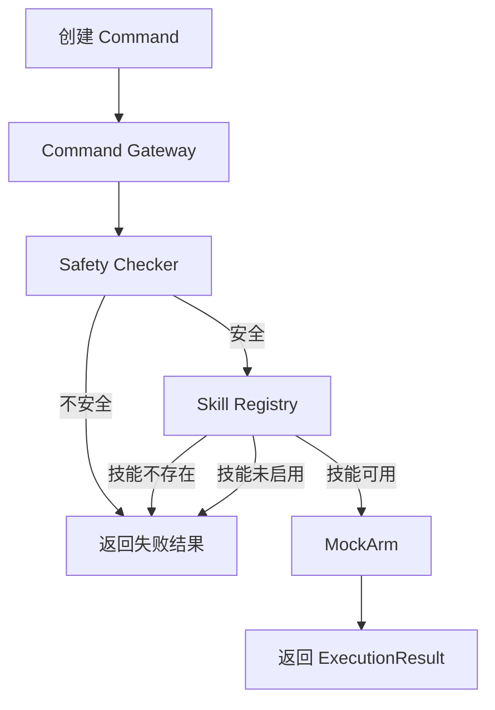

# RosClaw Mini

> 当前版本：**基础链路版**

RosClaw Mini 是一个面向机械臂控制场景的轻量级 Python 项目。本版本的目标不是直接连接真实机械臂，而是先建立一条清晰、可验证的基础命令链路：

```text
Command
  -> Safety Checker
  -> Skill Registry
  -> Command Gateway
  -> MockArm
  -> ExecutionResult
```

用户先构造结构化命令，Gateway 依次完成安全检查、技能查询和启用状态检查，最后交给模拟机械臂执行，并返回统一的执行结果。

## 版本定位

“基础链路版”已经实现：

- 机械臂命令、技能信息、安全结果和执行结果的数据结构
- 命令安全检查
- 内置技能注册表
- 技能存在性和启用状态查询
- Command Gateway 调度流程
- MockArm 模拟执行器
- 主程序运行示例
- Safety Checker、Skill Registry、MockArm 和 Gateway 的脚本式测试

本版本尚未实现：

- 真实机械臂驱动
- ROS 2 节点、Topic、Service 和 Action 接入
- Web API 和前端交互
- LLM 自然语言命令解析
- RAG 知识检索
- 状态机、持久化日志和自动评估
- YAML 配置加载
- 完整的 Python 包构建与依赖声明

仓库中已经为这些能力预留目录和文件，但多数仍为空文件，属于后续版本的扩展骨架。

## 核心流程

调用 `run_command(command, skills)` 后，系统按以下顺序处理命令：

1. **安全检查**
   `check_command()` 检查技能名称、参数类型、必需参数和坐标范围。
2. **安全拦截**
   如果命令不安全，Gateway 立即返回失败的 `ExecutionResult`，不再继续执行。
3. **技能查询**
   从传入的技能列表中查找与 `command.skill_name` 对应的 `SkillInfo`。
4. **启用状态检查**
   技能存在但 `enabled=False` 时，Gateway 返回“技能未启用”。
5. **模拟执行**
   检查全部通过后，由 `MockArm` 执行命令。
6. **统一返回**
   无论成功或失败，都使用 `ExecutionResult` 返回命令 ID、技能名称、状态和消息。



## 数据模型

基础链路使用 `dataclass` 定义四个核心对象。

### Command

表示一条待执行的机械臂命令。

| 字段 | 类型 | 说明 |
| --- | --- | --- |
| `command_id` | `str` | 命令唯一标识 |
| `skill_name` | `str` | 要执行的技能名称 |
| `params` | `dict` | 技能参数 |
| `source` | `str` | 命令来源，例如 `user` |

示例：

```python
Command(
    command_id="cmd-001",
    skill_name="move_arm",
    params={"x": 0.5, "y": 0.4, "z": 0.3},
    source="user",
)
```

### SafetyResult

表示 Safety Checker 的检查结果。

| 字段 | 类型 | 说明 |
| --- | --- | --- |
| `command_id` | `str` | 对应的命令 ID |
| `is_safe` | `bool` | 是否允许继续执行 |
| `risk_level` | `str` | 当前使用 `low` 或 `high` |
| `reason` | `str` | 检查结果或拒绝原因 |

### SkillInfo

描述一个已注册技能。

| 字段 | 类型 | 说明 |
| --- | --- | --- |
| `skill_name` | `str` | 技能名称 |
| `description` | `str` | 技能用途 |
| `risk_level` | `str` | 技能风险等级 |
| `enabled` | `bool` | 是否允许使用 |

### ExecutionResult

表示 Gateway 或 MockArm 的最终执行结果。

| 字段 | 类型 | 说明 |
| --- | --- | --- |
| `command_id` | `str` | 对应的命令 ID |
| `skill_name` | `str` | 执行的技能名称 |
| `success` | `bool` | 是否执行成功 |
| `message` | `str` | 执行结果或失败原因 |

## 内置技能

当前 `BUILTIN_SKILLS` 注册了四个技能：

| 技能 | 风险等级 | 默认状态 | 参数 | 作用 |
| --- | --- | --- | --- | --- |
| `move_arm` | `medium` | 启用 | `x`、`y`、`z` | 移动机械臂到指定位置 |
| `open_gripper` | `low` | 启用 | 无 | 打开夹爪 |
| `close_gripper` | `low` | 启用 | 无 | 关闭夹爪 |
| `stop` | `low` | 启用 | 无 | 停止当前动作 |

## 安全规则

Safety Checker 当前执行以下规则：

| 检查项 | 通过条件 | 失败结果 |
| --- | --- | --- |
| 技能名称 | 不能是 `None` 或空字符串 | `high` 风险，拒绝执行 |
| 参数容器 | `params` 必须是字典 | `high` 风险，拒绝执行 |
| `move_arm` 参数完整性 | 必须包含 `x`、`y`、`z` | `high` 风险，拒绝执行 |
| 坐标类型 | 坐标必须为 `int` 或 `float` | `high` 风险，拒绝执行 |
| 坐标范围 | `0 < x,y,z <= 1` | `high` 风险，拒绝执行 |
| 夹爪与停止命令 | 技能名称合法即可 | 判定为安全 |
| 未识别技能 | 不在已知安全规则中 | `high` 风险，拒绝执行 |

当前坐标范围直接写在检查器中，尚未从 `configs/safety_limits.yaml` 加载。

## MockArm 行为

MockArm 不会控制真实硬件，只返回模拟结果：

| 命令 | 模拟结果 |
| --- | --- |
| `move_arm` | 返回移动到指定坐标的成功消息 |
| `open_gripper` | 返回“已打开夹爪” |
| `close_gripper` | 返回“已关闭夹爪” |
| `stop` | 返回“已停止” |
| 其他技能 | 返回失败和“未知技能” |

因此，本版本适合验证数据流、业务顺序和失败分支，不适合用于真实设备控制。

## 环境要求

- Python 3.10 或更高版本
- 当前基础链路仅使用 Python 标准库
- 推荐使用 Conda 创建独立环境

项目使用了 `list[SkillInfo]` 和 `Service | None` 等类型标注，因此建议直接使用 Python 3.10+。

## 快速开始

### 1. 进入项目目录

```bash
cd rosclaw-mini
```

### 2. 创建并激活 Python 3.10 环境

如果本机还没有对应环境：

```bash
conda create -n rosclaw-mini-py310 python=3.10
conda activate rosclaw-mini-py310
```

如果环境已经创建：

```bash
conda activate rosclaw-mini-py310
```

### 3. 设置源码目录并运行

当前项目还没有配置可安装的 Python 包，因此运行时需要设置 `PYTHONPATH=src`：

```bash
PYTHONPATH=src python3 -m rosclaw_mini.main
```

预期输出：

```text
ExecutionResult(command_id='cmd-001', skill_name='move_arm', success=True, message='已移动机械臂到指定位置0.5,0.4,0.3')
```

## 使用示例

下面的示例展示了如何创建命令并经过完整链路执行：

```python
from rosclaw_mini.command_schema.commands import Command
from rosclaw_mini.gateway.command.gateway import run_command
from rosclaw_mini.skills.registry import BUILTIN_SKILLS

command = Command(
    command_id="cmd-001",
    skill_name="move_arm",
    params={
        "x": 0.5,
        "y": 0.4,
        "z": 0.3,
    },
    source="user",
)

result = run_command(command, BUILTIN_SKILLS)
print(result)
```

参数越界时，命令会在进入 MockArm 之前被拦截：

```python
command = Command(
    command_id="cmd-002",
    skill_name="move_arm",
    params={"x": 2.0, "y": 0.4, "z": 0.3},
    source="user",
)
```

对应结果：

```text
ExecutionResult(
    command_id='cmd-002',
    skill_name='move_arm',
    success=False,
    message='UnsafeCommand, Invalid x: 2.0'
)
```

## 测试

当前测试文件采用“直接构造对象、执行并使用 `assert` 检查”的脚本形式，可以通过模块方式运行。

### Safety Checker

```bash
PYTHONPATH=src python3 -m tests.test_safety_checker
```

覆盖：

- 正常坐标
- 坐标越界
- 缺少坐标参数
- 无参数夹爪命令

### Skill Registry

```bash
PYTHONPATH=src python3 -m tests.test_skill_registry
```

覆盖：

- 查询已注册技能
- 查询不存在的技能

### MockArm

```bash
PYTHONPATH=src python3 -m tests.test_mock_arm
```

覆盖：

- 移动机械臂
- 打开夹爪
- 未知技能

### Command Gateway

```bash
PYTHONPATH=src python3 -m tests.test_gateway
```

覆盖：

- 正常命令执行
- 参数越界拦截
- 未知技能拦截
- 已注册但未启用的技能

## 当前测试状态

经 Python 3.10 环境验证：

| 模块 | 状态 |
| --- | --- |
| `rosclaw_mini.main` | 通过 |
| `tests.test_safety_checker` | 通过 |
| `tests.test_skill_registry` | 通过 |
| `tests.test_mock_arm` | 通过 |
| `tests.test_gateway` | 当前存在断言消息不一致 |

`tests.test_gateway` 中业务分支已经返回预期的成功或失败状态，但测试使用了完整字符串相等判断：

- 未知技能实际返回 `UnsafeCommand, Unknown skill: destroy_arm`，断言期望 `技能不存在`
- 禁用技能实际返回 `技能未启用: move_arm`，断言期望 `技能未启用`

这属于测试预期与当前返回文案不一致，不是 Python 环境或 `PYTHONPATH` 问题。

## 项目结构

```text
rosclaw-mini/
├── README.md
├── pyproject.toml
├── requirements.txt
├── configs/                     # 配置文件占位
│   ├── default.yaml
│   ├── safety_limits.yaml
│   └── skills.yaml
├── docs/                        # 项目文档占位
├── eval/                        # 评估数据占位
├── notebooks/
│   ├── gateway_prototype.py     # 早期交互式 Gateway 原型
│   ├── handler.py               # 请求处理原型
│   ├── registry.py              # 服务查询原型
│   └── router.py                # 路由匹配原型
├── scripts/                     # 运行脚本占位
├── src/
│   └── rosclaw_mini/
│       ├── main.py              # 基础链路入口
│       ├── command_schema/
│       │   ├── commands.py      # Command 等核心数据模型
│       │   └── schemas.py       # 早期 Gateway 数据模型
│       ├── safety/
│       │   └── checker.py       # 命令安全检查
│       ├── skills/
│       │   └── registry.py      # 内置技能和技能查询
│       ├── gateway/
│       │   └── command/
│       │       └── gateway.py   # 命令调度核心
│       ├── arm/
│       │   └── mock_arm.py      # 模拟机械臂执行器
│       ├── evaluation/          # 后续评估模块
│       ├── llm/                 # 后续 LLM 模块
│       ├── logging/             # 后续日志模块
│       ├── rag/                 # 后续 RAG 模块
│       ├── ros2/                # 后续 ROS 2 模块
│       ├── state/               # 后续状态机模块
│       └── web/                 # 后续 Web API 模块
└── tests/
    ├── test_gateway.py
    ├── test_mock_arm.py
    ├── test_safety_checker.py
    └── test_skill_registry.py
```

## 核心文件说明

| 文件 | 职责 |
| --- | --- |
| `src/rosclaw_mini/main.py` | 构造示例命令并启动基础链路 |
| `src/rosclaw_mini/command_schema/commands.py` | 定义基础链路数据结构 |
| `src/rosclaw_mini/safety/checker.py` | 判断命令能否安全执行 |
| `src/rosclaw_mini/skills/registry.py` | 保存和查询内置技能 |
| `src/rosclaw_mini/gateway/command/gateway.py` | 编排检查、查询和执行流程 |
| `src/rosclaw_mini/arm/mock_arm.py` | 模拟执行机械臂技能 |

## 当前边界与注意事项

1. **未知技能会先被 Safety Checker 拦截**
   Gateway 先做安全检查，再查询 Skill Registry。未知技能会得到 `UnsafeCommand`，通常不会进入“技能不存在”分支。
2. **坐标规则是固定值**
   `move_arm` 的三个坐标目前都要求 `0 < value <= 1`。
3. **MockArm 不代表真实硬件状态**
   它只根据命令返回预设结果，没有运动学、碰撞检测或硬件反馈。
4. **风险等级尚未参与动态决策**
   `SkillInfo.risk_level` 已保存，但 Gateway 暂未根据风险等级执行额外策略。
5. **配置文件尚未接入**
   技能列表和安全边界仍直接写在 Python 代码中。
6. **测试尚未统一为 pytest 风格**
   当前测试主要在模块加载时执行，不是独立的测试函数。
7. **早期服务 Gateway 原型尚未接入主链路**
   `notebooks/` 中的路由、服务注册和请求处理代码属于探索性实现。

## 后续演进方向

基础链路稳定后，可以按以下顺序逐步扩展：

1. 统一 Gateway 返回消息与测试断言
2. 将技能和安全限制迁移到 YAML 配置
3. 完善 pytest 测试和边界用例
4. 增加结构化日志与命令追踪
5. 接入机械臂 Adapter 抽象
6. 在 MockArm 之外实现 ROS 2 Adapter
7. 增加 Web API
8. 接入 LLM 命令解析，并确保所有生成命令仍经过 Safety Checker
9. 增加 RAG、安全规则文档和自动评估

## 版本说明

**基础链路版**关注的是最小闭环：

```text
命令能够被描述
-> 命令能够被检查
-> 技能能够被查询
-> 命令能够被模拟执行
-> 执行结果能够被统一返回
```

它为后续接入真实机械臂、ROS 2、Web API、LLM 和 RAG 提供了一个可理解、可运行、可继续扩展的起点。
