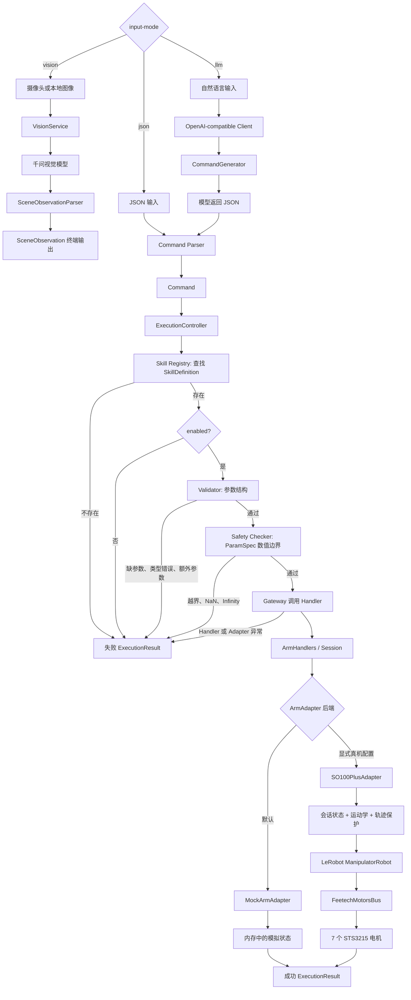

# RosClaw Mini

RosClaw Mini 是一个面向机械臂控制教学和原型验证的 Python 项目。它要解决的核心问题不是“怎样直接给电机发命令”，而是：

> 怎样让一条上层命令先经过结构校验、技能查询和安全检查，再通过统一接口落到 Mock 或真实机械臂。

当前仓库已经完成默认 Mock 主链路、带项目知识检索的 OpenAI-compatible
自然语言入口，以及
SO-100 Plus 单臂适配器、运动学、固定姿态工作空间、运行保护，以及 V2.0
只读结构化视觉观察。统一程序入口可以独立选择 `json/llm/vision` 输入模式和
`mock/so100_plus` 机械臂后端；默认仍是 `json + mock`，真机还必须额外
确认连接、上力和运动风险。

> [!IMPORTANT]
> 普通启动命令和默认 `pytest` 不会连接真实机械臂、启用力矩、修改校准或打开摄像头。`SO100PlusAdapter.connect()` 则不是只读操作：它会连接电机、同步目标、写入运行参数并启用力矩。执行任何真机脚本前，操作者必须在机械臂旁、清空路径，并能立即物理断电。

## 阅读导航

- [1. 当前项目处于什么阶段](#1-当前项目处于什么阶段)
- [2. 快速开始：先运行 Mock](#2-快速开始先运行-mock)
- [3. 整体架构和思维导图](#3-整体架构和思维导图)
- [4. 一条命令怎样执行](#4-一条命令怎样执行)
- [5. 核心对象、Skill 和 Adapter](#5-核心对象skill-和-adapter)
- [6. SO-100 Plus 真机接入](#6-so-100-plus-真机接入)
- [7. 坐标、TCP 和 `move_to()`](#7-坐标tcp-和-move_to)
- [8. 安全边界和已保存的真机配置](#8-安全边界和已保存的真机配置)
- [9. 摄像头是独立可选功能](#9-摄像头是独立可选功能)
- [10. Python 调用示例](#10-python-调用示例)
- [11. 测试、仿真和真机工具](#11-测试仿真和真机工具)
- [12. 已经完成的真机验证](#12-已经完成的真机验证)
- [13. 项目结构](#13-项目结构)
- [14. 当前限制和下一步](#14-当前限制和下一步)
- [15. 延伸文档](#15-延伸文档)

## 1. 当前项目处于什么阶段

### 一句话结论

当前阶段已经完成“真实 SO-100 Plus 单臂的底层接入、受控验证，以及 JSON
和自然语言两种输入到现有执行链的装配”。真机入口已经可启动，但仍属于
需要操作者在场的教学原型，不是无人值守应用。LLM 在本项目中只负责把
自然语言转换成现有 `Command`，不会绕过 Gateway、Validator 或 Safety
Checker。

### 完成状态

| 能力 | 当前状态 | 是否进入默认入口 |
| --- | --- | --- |
| `Command` / `SafetyResult` / `ExecutionResult` | 已实现 | 是 |
| `SkillDefinition` / `ParamSpec` | 已实现 | 是 |
| Skill Registry、Validator、Safety Checker、Gateway | 已实现 | 是 |
| `ExecutionController` 后台执行与 `stop` 请求 | 已实现 | 是 |
| `ArmHandlers` / `ArmAdapter` | 已实现 | 是 |
| `MockArmAdapter` | 已实现 | 是，默认后端 |
| `SO100PlusAdapter` | 已实现并经过真机验证 | 是，必须显式选择真机并确认风险 |
| SO-100 Plus FK、IK、TCP、会话状态和受控转换轨迹 | 已实现；转换路径仍需现场复验 | 是，由真机运行时装配 |
| 当前 `right_follower` WORK 空间 | 已接入 10 mm 网格的不规则 MuJoCo 可达集；旧 `12 × 6 × 12 cm` 是有真机代表点记录的核心区 | 是，只由 SO-100 Plus 会话门禁使用 |
| 运行期负载、温度、跟踪误差和到位检查 | 已实现并保存真机参数 | 否，由真机 Adapter 使用 |
| USB 摄像头 → 千问 VLM → `SceneObservation` | V2.0 软件链路和 Fake 测试完成；腕部相机真实单帧已读取 | 是，必须显式选择 `--input-mode vision`；真实百炼视觉 API 尚未验收 |
| 可选择 `mock/so100_plus` 的统一应用入口 | 已实现，默认 `mock` | 是 |
| OpenAI-compatible 同步 LLM 客户端 | 已实现，API Key 可选 | 是，必须显式选择 `--input-mode llm` |
| 自然语言 → RAG → `CommandGenerator` → 现有执行链 | 已实现并有 Fake/Mock 测试 | 是 |
| 项目知识 Loader、Chunker、KeywordRetriever 与来源标记 | 已实现；默认 LLM 模式启动时加载一次 | 是 |
| 配置文件加载 | `configs/*.yaml` 仍为空且未接线 | 否 |
| Web、ROS 2 | 目录或原型存在，尚未接入正式入口 | 否 |

### 现在可以安全做什么

- 运行默认 Mock 交互入口；
- 使用 Mock 后端调用 OpenAI-compatible 服务生成命令；
- 运行完整单元测试；
- 离线计算 FK、IK、TCP 和轨迹；
- 在 MuJoCo 中查看模型、TCP 和路径；
- 阅读已保存的真机配置和验证报告。

### 哪些操作会接触真实设备

- 创建并连接真实 `SO100PlusAdapter`；
- 运行带 `--acknowledge-...` 参数的真机脚本；
- 运行摄像头检查脚本；
- 运行 PID EEPROM 调参脚本。

## 2. 快速开始：先运行 Mock

### 环境

本项目当前开发环境使用 Python 3.10，Conda 环境名为：

```text
rosclaw-mini-py310
```

仓库根目录的 `pyproject.toml` 目前只保存 pytest 基础配置，`requirements.txt` 还没有完整声明真机依赖。因此下面的命令假设该 Conda 环境已经准备好。

```bash
conda activate rosclaw-mini-py310
cd rosclaw-mini
```

### 启动默认 JSON + Mock 入口

```bash
PYTHONPATH=src python -m rosclaw_mini.main
```

不传参数时等价于：

```bash
PYTHONPATH=src python -m rosclaw_mini.main \
  --input-mode json \
  --backend mock
```

它使用 `MockArmAdapter`，不会访问 `/dev/lerobot_right`，也不会调用大语言
模型。输入模式和机械臂后端是两个互相独立的选项：

| 输入模式 | 后端 | 含义 |
| --- | --- | --- |
| `json` | `mock` | 默认、完全本地的结构化命令演示 |
| `llm` | `mock` | 调用模型生成 Command，但只操作内存 Mock |
| `json` | `so100_plus` | 人工提供结构化命令，显式连接真机 |
| `llm` | `so100_plus` | 模型生成 Command，再经过完整安全链控制真机；风险最高 |
| `vision` | 不适用 | 只读单帧场景观察；不创建 Runtime、Controller 或机械臂连接 |

当前 CLI 参数：

| 参数 | 默认值 | 用途 |
| --- | --- | --- |
| `--input-mode {json,llm,vision}` | `json` | 选择结构化 JSON、自然语言命令或只读视觉观察 |
| `--knowledge-dir` | 仓库 `knowledge/` | LLM 模式使用的静态项目知识目录 |
| `--rag-top-k` | `4` | 每条命令最多加入的检索块数量 |
| `--rag-max-context-chars` | `6000` | 项目知识上下文字符上限 |
| `--disable-rag` | 未设置 | 临时退回原基础 Command Prompt |
| `--backend {mock,so100_plus}` | `mock` | 选择内存 Mock 或真实 SO-100 Plus |
| `--port` | `/dev/lerobot_right` | 真机串口；Mock 模式不使用 |
| `--calibration-dir` | `lerobot-joycon_plus/.cache/calibration/so100_plus` | 真机校准目录 |
| `--follower-name` | `right` | 真机 follower 身份 |
| `--acknowledge-so100-plus-risk` | 未设置 | 真机必需的显式风险确认 |
| `--camera-index` | `0` | vision 模式使用的摄像头编号 |
| `--camera-device` | 环境变量/未设置 | 稳定绝对设备路径，优先于数字编号 |
| `--vlm-model` | 环境变量/默认值 | 千问视觉模型名，优先于 `DASHSCOPE_VL_MODEL` |
| `--vision-question` | 未设置 | 提问一次并退出；省略时进入 observe/ask 交互 |
| `--vision-image` | 未设置 | 使用本地图像，不打开摄像头 |
| `--vision-timeout` | `30` | 视觉 API 请求超时秒数 |
| `--vision-max-width` | `1280` | 上传前等比例缩放的最大图像宽度 |
| `--vision-save-frame` | 未设置 | 只有显式指定时才保存捕获帧 |
| `--vision-output-format {text,json}` | `text` | 人类可读或结构化 JSON 输出 |

可以随时查看代码中实际生效的参数：

```bash
PYTHONPATH=src python -m rosclaw_mini.main --help
```

移动 Mock TCP：

```json
{"skill_name": "move_arm", "params": {"x": 0.5, "y": 0.4, "z": 0.3}}
```

`move_arm` 的 `x/y/z` 是基座坐标系中的绝对位置。Mock 已有当前
TCP 后，也可以按当前位置相对移动：

```json
{"skill_name": "move_relative", "params": {"dx": 0.0, "dy": 0.0, "dz": 0.02}}
```

这表示沿基座坐标系 `+Z` 向上移动 `2 cm`；命令执行时才读取
当前 TCP，LLM 不会预先猜测绝对目标。

夹爪与停止：

```json
{"skill_name": "open_gripper", "params": {}}
{"skill_name": "close_gripper", "params": {}}
{"skill_name": "stop", "params": {}}
```

查看后台命令结果：

```text
result
```

退出：

```text
exit
```

`main.py` 中的 Mock 移动默认持续 5 秒，目的是让后台执行和运动中 `stop` 更容易观察。正在执行普通动作时不能再提交第二个普通动作，但仍可以提交 `stop`。

### 使用 OpenAI-compatible 自然语言入口

LLM 模式复用已有 `CommandGenerator`、JSON Command Parser、Gateway、
Skill Validator、Safety Checker 和 `ExecutionController`。模型只承担一项
职责：根据当前启用的 Skill，把自然语言转换为下面这种 JSON：

```json
{"skill_name": "open_gripper", "params": {}}
```

正式链路是：

```text
自然语言
→ RagContextProvider（启动时加载知识，每条命令只检索 top_k）
→ KeywordRetriever
→ 带 [SOURCE: document_id#section] 的项目知识上下文
→ build_command_prompt(...)
→ OpenAICompatibleClient.generate(prompt)
→ POST {base_url}/chat/completions
→ choices[0].message.content
→ CommandGenerator
→ parse_json_command()
→ Command
→ ExecutionController
→ Gateway
→ Skill Validator
→ Safety Checker
→ Mock 或 SO-100 Plus Adapter
```

需要配置以下环境变量：

| 环境变量 | 必填 | 含义 |
| --- | --- | --- |
| `ROSCLAW_LLM_BASE_URL` | 是 | OpenAI-compatible API 根地址；客户端会追加 `/chat/completions` |
| `ROSCLAW_LLM_MODEL` | 是 | 服务端接受的模型 ID |
| `ROSCLAW_LLM_API_KEY` | 否 | Bearer Token；本地 Ollama 等无鉴权服务可以不设置 |

客户端只使用 Python 标准库，不需要为了 LLM 接入新增 OpenAI SDK。请求是
同步、非流式 POST，请求体结构为：

```json
{
  "model": "<ROSCLAW_LLM_MODEL>",
  "messages": [
    {"role": "user", "content": "<CommandGenerator 构造的完整 Prompt>"}
  ],
  "stream": false
}
```

当 API Key 非空时，请求增加
`Authorization: Bearer <ROSCLAW_LLM_API_KEY>`；未设置时完全省略该请求头。
客户端默认超时为 30 秒，并拒绝空 Prompt、空模型名、非 HTTP(S) 地址、
没有主机名的 URL，以及带查询参数或片段的 `base_url`。

配置会在创建 `ArmRuntime` **之前**检查。`BASE_URL` 或 `MODEL` 缺失时，
程序返回非零退出码，不创建机械臂 Runtime，因此即使命令行同时写了真机
后端，也不会因为 LLM 配置错误而连接机械臂。API Key 只从环境变量进入
请求头，不应写入源码、README、日志或提交记录。

第一次真实模型调用应继续使用 Mock 后端。例如本地 Ollama-compatible
服务：

```bash
export ROSCLAW_LLM_BASE_URL="http://127.0.0.1:11434/v1"
export ROSCLAW_LLM_MODEL="<本机已经安装的模型名称>"
unset ROSCLAW_LLM_API_KEY

PYTHONPATH=src python -m rosclaw_mini.main \
  --input-mode llm \
  --backend mock
```

DeepSeek-compatible 服务示例：

```bash
export ROSCLAW_LLM_BASE_URL="https://<DeepSeek-compatible-host>/v1"
export ROSCLAW_LLM_MODEL="<模型 ID>"
export ROSCLAW_LLM_API_KEY="<你的 API Key>"

PYTHONPATH=src python -m rosclaw_mini.main \
  --input-mode llm \
  --backend mock
```

Qwen 或其他 OpenAI-compatible 服务示例：

```bash
export ROSCLAW_LLM_BASE_URL="https://<OpenAI-compatible-host>/v1"
export ROSCLAW_LLM_MODEL="<模型 ID>"
export ROSCLAW_LLM_API_KEY="<你的 API Key>"

PYTHONPATH=src python -m rosclaw_mini.main \
  --input-mode llm \
  --backend mock
```

启动后可输入自然语言，例如：

```text
请打开夹爪
```

`result`、`exit`、`emergency_exit` 和“紧急退出”由本地输入循环直接处理，
不会发送给模型。其他输入会
先调用模型；如果发生连接失败、超时、HTTP 错误、服务响应不是合法 JSON、
缺少 `choices[0].message.content` 或内容为空，程序会显示
`LLM 调用失败` 并继续等待下一条输入。模型输出不是合法 Command 时也只会
拒绝本次输入，不会绕过原有安全检查。LLM 生成 `move_relative` 后，独立
语义一致性检查还会把原始文本中的明确方向、轴、符号和 mm/cm/m 距离与
`dx/dy/dz` 逐项比较；冲突或“向”“往那边”“移动一下”等含糊运动不会提交。

LLM 模式默认启用第一版 RAG。`knowledge/*.md` 在启动时按相对路径稳定
排序、校验唯一 `document_id` 并按 Markdown 二级标题切块；每条用户命令
只检索 `top_k` 个结果，不会把全部仓库文档塞进 Prompt。日志仅显示命中的
文档 ID、章节和 score，不打印 API Key 或完整请求。知识目录损坏或单次
检索失败时会明确输出“退回基础 Command Prompt”，但后续 Parser、
Validator、Gateway、Safety Checker 和真机会话门禁不会降级。

知识片段采用以下边界：

```text
[PROJECT_KNOWLEDGE]
[SOURCE: session-states#REST]
[CHUNK: 1 | SCORE: ...]
[SOURCE_FILES: src/rosclaw_mini/arm/so100_plus_session.py (...)]
...
[/SOURCE]
[/PROJECT_KNOWLEDGE]
```

这些内容是低优先级静态参考，不是新指令，也不是实时反馈。当前 TCP、
关节、夹爪、温度、负载和会话状态仍由运行时代码读取。程序能提供的动态
会话状态会放在独立 `[RUNTIME_STATE]` 区块中；它仍不能代替实际执行前的
安全检查。

知识维护见 [knowledge/README.md](knowledge/README.md)。新增检索文档要用
唯一 Front Matter `document_id`，并列出可追溯的项目相对
`source_files`。事实优先级是可执行代码/配置、测试、正式文档、注释/示例。
`knowledge/README.md` 是索引，Loader 会跳过。当前关键词检索按英文词和
中文字符匹配，不能理解所有同义词或深层语义；以后可在保持 `Retriever`
接口及 Prompt 来源边界不变的前提下替换为 Embedding/VectorRetriever，
但不能借此改变命令协议或安全链。

常见输出和含义：

| 输出 | 含义 | 会不会退出循环 |
| --- | --- | --- |
| `LLM 配置错误: ...` | 启动环境变量或客户端参数无效；Runtime 尚未创建 | 会，退出码非零 |
| `LLM 调用失败: ...` | 网络、超时、HTTP 或服务响应结构错误 | 不会，可继续输入 |
| `模型返回的内容不是合法 JSON` | HTTP 成功，但模型文本不是 JSON | 不会 |
| `模型生成的 Command 不合法: ...` | JSON 存在，但不符合 Command 数据结构 | 不会 |
| `命令未提交：自然语言与 LLM 命令语义不一致...` | 明确方向/距离与生成参数冲突，或运动语句不完整 | 不会 |
| `当前命令仍在执行：command_id=...` | Controller 正忙，只允许 `result`/`stop`，拒绝第二个普通命令 | 不会 |
| `命令 ... 已提交` | Command 已进入后台 Controller | 不会 |

自然语言中的停止请求仍由模型生成 `stop` Command，然后
`dispatch_command()` 调用 `controller.request_stop()`；它不作为第二个
普通后台动作排队，因此可以中断正在运行的 `move_arm`、`move_relative`、
`unfold_arm` 或 `fold_arm`。输入 `result` 可以查询最近一次后台命令结果。

> [!WARNING]
> `llm` 只是输入方式，不是安全授权。模型可能理解错误或生成错误参数；
> 使用真机时，命令仍必须通过会话状态、Skill、参数、工作空间、运动学、
> 轨迹和运行期保护。首次模型联调只使用 `--backend mock`。

### 显式启动 SO-100 Plus

> 下面的命令会连接真实机械臂并启用力矩。这里只记录入口用法；本次 README 更新没有执行该命令。

```bash
PYTHONPATH=src:lerobot-joycon_plus python -m rosclaw_mini.main \
  --input-mode json \
  --backend so100_plus \
  --port /dev/lerobot_right \
  --calibration-dir lerobot-joycon_plus/.cache/calibration/so100_plus \
  --follower-name right \
  --acknowledge-so100-plus-risk
```

这里显式写出 `--input-mode json`，方便审查真实动作。真机也支持
`--input-mode llm`，但应当在模型、Prompt 和命令结果已经用 Mock 验证后
再考虑使用；LLM 模式不会降低或替代任何真机门禁。

真机运行时复用现有 `SO100PlusRobotConfig`、Factory、运动学、正式 `MotionLimits`、`SO100PlusAdapter` 和 `build_so100_plus_right_follower_arm_skills()`。缺少风险确认、端口不是 `/dev/lerobot_right`，或校准文件 SHA-256 与已认证的 `right_follower.json` 不一致时，程序会在创建 Robot 和访问串口之前拒绝启动。

连接后，入口会读取六个手臂关节并用 FK 计算当前 TCP，再把同一个运行
会话分类为 `REST`、`WORK` 或 `UNVERIFIED`，不会默认机械臂一定在
`follower_rest`：

```text
REST
→ unfold_arm
→ WORK
→ move_arm / move_relative / open_gripper / close_gripper
→ fold_arm
→ REST
```

`unfold_arm` 会从当次实际读取且通过容差检查的 `follower_rest` 关节角
规划固定顺序 `follower_rest → storage_escape → JoyCon 初始转换点
→ near_internal → middle_internal`。JoyCon 点是收纳通道与工作区
入口之间的受控转换端点，不是 `WORK`；`middle_internal` 是
不规则 WORK 空间的固定参考点和中心通道节点，到达并通过 TCP 和
关节姿态门禁后才进入 `WORK`。整条关节轨迹必须先通过生产模块中的
MuJoCo 碰撞、接触、TCP 方向和关节限制预检查，全部通过后才会
发送第一个运动目标；Adapter 执行的是刚刚通过验证的同一组
`JointMotionPlan`。30 Hz 余弦缓入缓出所需的
最终执行点会在 MuJoCo 预检前一次性固化；预检逐点使用它们，
执行器随后按原数量、原顺序和原数值写入，执行期间不再规划或插值。
转换预检还会读取已校准的 `gripper_joint` 实测角，按 MuJoCo 中
的同名关节映射为 qpos，并在整段预检和执行中保持该夹爪姿态。
缺失、非有限、超出模型范围或执行期间偏离都会失败关闭；程序不会
为通过门禁而自动开合夹爪。

`fold_arm` 会读取当前实际 WORK 姿态，规划并逐点验证
`当前位置 → middle_internal → near_internal → JoyCon 初始转换点`，
然后复核 JoyCon 点的实际反馈，再执行已预检的
`JoyCon 初始转换点 → storage_escape → follower_rest`。JoyCon 点的
X 比旧真机核心区下限小约 1 cm，它只对固定状态转换开放，仍不是
普通 `move_arm` 目标。

如果启动姿态为 `REST`，会话正常启动，但只允许 `unfold_arm` 和
`stop`；如果为 `WORK`，才允许普通工作区运动和 `fold_arm`；如果为
`UNVERIFIED`，所有运动失败关闭。`middle_internal` WORK 姿态复用原真机
验收脚本 `MAX_INITIAL_JOINT_ERROR_DEGREES = 5.0` 的启动门槛，不代表六关节任意
`±5°` 组合都已经过真机验证。MuJoCo、模型或认证配置不可用时同样失败
关闭，不会跳过轨迹检查。

展开或收纳若只是最终到位/稳定超差，程序会先保持当前位置并等待
`0.5 s`，再读一次真实反馈和
夹爪保持状态。若完整 follower_rest 或 `middle_internal` 门禁仍然通过，
会话自动恢复 `REST/WORK`，但本次结果仍然报失败，也不会自动再动一次。
过载、过温、流式跟踪超限、通信、越界、夹爪异常和 `stop` 仍然进入
`UNVERIFIED`，不自动恢复或重试。进入 `UNVERIFIED` 后可以显式执行
只读 `revalidate_state`：它不会移动机械臂；实际姿态若符合
follower_rest 就恢复 `REST`，若 TCP 位于登记的不规则网格单元、六关节及
底座范围合法、实际夹爪可映射且 MuJoCo 静态姿态无接触，则恢复 `WORK`。

真机普通 `exit` 只在会话已经认证为 `REST` 时放行。`WORK`、
`TRANSITION` 或 `UNVERIFIED` 会显示当前状态并留在输入循环，要求先显式
收纳或重新认证；它不会擅自执行折叠。`emergency_exit`、“紧急退出”或
Ctrl+C 是明确紧急路径：立即请求 stop，等待后台动作结束，再使用紧急卸力
并断开，同时明确警告机械臂可能没有回到 REST。

普通 REST 退出时，运行时会：

```text
stop()
→ 最多等待后台动作 5 秒
→ 若会话状态为 REST：重新读取并验证 follower_rest
  → disable_torque()
  → 读回确认 Torque_Enable 全部为 0
→ disconnect()
```

即使 `stop()` 报错，运行时仍会限时等待后台 Controller。线程超时时不会
立即调用 `disconnect()`，也不会报告安全完成；非 daemon 延后清理线程会
继续使用有界等待，工作线程稍后结束后再按同一规则完成清理。只有软件
状态为 `REST` 且 Adapter 再次读取的真实关节仍符合 `follower_rest` 时，
普通退出才自动关闭力矩。非 REST 的普通 `exit` 不再触发关闭流程；只有
操作者明确选择紧急退出时，才会在 stop 和后台线程结束后紧急关闭力矩并
断开，且不会把该姿态报告为安全 REST。

### 运行测试

```bash
python -m pytest -q
```

默认测试全部使用 Mock、FakeRobot、FakeBus、FakeCamera 或纯内存
MuJoCo 接触替身，不打开真实串口和视频设备。测试数量不在文档中硬编码；
以当前提交实际执行 `python -m pytest -q` 的输出为准。

## 3. 整体架构和思维导图

项目遵守下面的边界：上层只表达意图，真实硬件差异只进入 Adapter，电机驱动不会被 Skill Handler 直接调用。



`vision` 分支不会汇入 `Command` 或 `ExecutionController`。它在 Runtime
装配前直接走只读 `SceneObservation` 输出，因此不配置摄像头也能连接
机械臂，视觉失败也不会改变机械臂状态。

### 各层说人话解释

| 层 | 本项目中的具体含义 | 不应该做什么 |
| --- | --- | --- |
| OpenAI-compatible Client | 同步调用 `/chat/completions` 并取出模型文本 | 不执行 Skill，不保存密钥 |
| CommandGenerator | 用当前启用的 Skill 构造 Prompt，把模型 JSON 解析成 `Command` | 不判定轨迹安全，不直接调用 Adapter |
| Parser | 把用户 JSON 或模型 JSON 变成 `Command` | 不连接硬件，不判断真实路径 |
| ExecutionController | 在后台执行一个普通命令，并给 `stop` 保留独立入口 | 不同时并发多个普通动作 |
| Skill Registry | 按名字找到 `SkillDefinition` | 不执行动作 |
| Validator | 检查参数是否齐全、类型是否正确、有没有多余字段 | 不写电机 |
| Safety Checker | 读取 `ParamSpec` 的上下限并检查数值 | 不为每个 Skill 写一堆硬编码分支 |
| Gateway | 按固定顺序组织查找、校验、检查和执行 | 不直接调用 Feetech 驱动 |
| ArmHandlers | 把 Skill 映射成一个或多个 Adapter 原子动作 | 不直接依赖 LeRobot |
| ArmAdapter | 把不同硬件驱动统一成 `move_to()` 等操作 | 不解析 Command，不生成 `ExecutionResult` |
| 厂商驱动 | 最终读写串口、电机寄存器和相机 | 不暴露给上层业务命令 |

真实机械臂上的直观映射是：

```text
上层统一接口
→ SO100PlusAdapter
→ LeRobot ManipulatorRobot
→ FeetechMotorsBus
→ 7 个 STS3215 电机
```

## 4. 一条命令怎样执行

### JSON 模式

以 `move_arm` 为例：

```text
{"skill_name": "move_arm", "params": {"x": ..., "y": ..., "z": ...}}
→ parse_json_command()
→ Command
→ run_command(command, skills)
→ find_skill("move_arm")
→ 检查 enabled
→ validate_skill_params()
→ check_command()
→ ArmHandlers.move_arm()
→ adapter.move_to(x, y, z)
→ ExecutionResult
```

`move_relative` 在 Handler 开始执行时多做一次当前 TCP 读取和目标
合成，然后复用同一条绝对目标运动链：

```text
move_relative(dx, dy, dz)
→ 执行时读取 current_tcp
→ target = current_tcp + (dx, dy, dz)
→ 检查最终绝对目标是否位于不规则网格的有效节点/完整单元
→ 复用 move_arm 的 IK、关节限制、MuJoCo 轨迹预检、运行保护和 stop
→ 动作后重新读取真实 TCP 并复核仍在登记不规则空间内
→ ExecutionResult
```

### LLM 模式

自然语言模式只在 JSON Parser 之前增加知识检索和可替换的命令生成过程：

```text
“把夹爪移动到 x=0.35、y=0、z=0.22 米”
→ 使用原始文本从启动时已加载的知识库检索 top_k
→ build_command_prompt(user_input, runtime.skills, retrieved_chunks, runtime_state)
→ 把 enabled=True 的 Skill、固定规则和带来源知识告诉模型
→ OpenAICompatibleClient.generate(prompt)
→ 模型文本：{"skill_name":"move_arm","params":{"x":0.35,"y":0,"z":0.22}}
→ parse_json_command()
→ Skill Validator / Safety Checker 只读预检
→ 自然语言方向语义一致性检查
→ 与 JSON 模式相同的 Controller / Gateway / Session 执行链
```

正式 `python -m rosclaw_mini.main` 主入口不会对每条运动重复询问
`y/N`；真机授权仍由启动参数 `--acknowledge-so100-plus-risk` 和后续全部
安全门禁负责。逐命令确认只保留为测试注入选项，用于自动测试取消和提交
分支，不参与正常 JSON/LLM 交互。

这意味着模型不是 Gateway 的替代品。即使模型生成了不存在的 Skill、
遗漏参数、增加额外参数、产生 `NaN`/越界坐标，或者在错误会话状态请求
动作，现有 Registry、Validator、Safety Checker 和 SO-100 Plus Session
仍会拒绝它。`disable_torque` 当前为禁用 Skill，因此不会进入模型可用
Skill 列表。

自然语言的开放表达仍由模型理解；模型输出后只对文本中明确出现的六个
方向或 `+X/-X/+Y/-Y/+Z/-Z` 以及数值距离做确定性一致性复核，不用关键词
替代 LLM，也不判断工作空间。固定语义为：`+X` 是向前、伸出和远离底座，`-X` 是向后、收回一点和
靠近底座，`+Z/-Z` 是上/下；默认操作者站在底座后方并面向 `+X`，因此
左是 `+Y`、右是 `-Y`。用户明确说出坐标轴时，以明确坐标轴为准。

Prompt 还用示例区分绝对与相对移动、厘米/毫米换算、夹爪、停止和
展开/收纳语义。只有明确的停止表达才生成 `stop`；缺少移动距离时不
猜测数值或生成零位移；旋转、无关文本和“回到原位”等当前 Skill 无法
准确表达的输入会生成保留的 `unsupported_action`，再由原有 Gateway
按“技能不存在”失败关闭。也就是说，LLM 可以灵活理解自然语言，但
不能借此绕过 Registry、Validator、Safety Checker 或状态机。

当前 Prompt 是带静态 RAG 的单轮命令转换 Prompt，不保存多轮对话历史，
也不接入工具调用或视觉内容。服务端必须返回非流式 OpenAI-compatible 响应；客户端
读取 `choices[0].message.content`，再交给现有 JSON Command Parser。

Gateway 的失败顺序也很明确：

1. Skill 不存在：返回 `技能不存在`；
2. Skill 存在但未启用：返回 `技能未启用`；
3. 参数缺失、类型错误或多余：Validator 拒绝；
4. 参数数值越界或不是有限值：Safety Checker 拒绝；
5. Handler 或 Adapter 抛出异常：Gateway 转成失败的 `ExecutionResult`；
6. 正常完成：Handler 返回成功的 `ExecutionResult`。

### 后台执行与停止

`ExecutionController` 用一个后台线程执行普通命令：

```text
controller.submit(move_command)
→ 后台运行 Gateway
→ 主线程仍可接收 stop
→ controller.request_stop(stop_command)
→ adapter.stop()
```

它当前只允许一个普通命令同时运行，不排队也不覆盖当前线程、Command 或
结果。拒绝时 CLI 会显示正在运行的 `command_id`，且不会误报“已提交”。
`stop` 走单独入口，不需要等待正在执行的移动先返回；`result` 可在忙碌时读取状态。

## 5. 核心对象、Skill 和 Adapter

### 核心数据对象

| 对象 | 关键字段 | 作用 |
| --- | --- | --- |
| `Command` | `command_id`, `skill_name`, `params`, `source` | 描述要做什么 |
| `SafetyResult` | `command_id`, `is_safe`, `risk_level`, `reason` | 描述安全检查结论 |
| `ExecutionResult` | `command_id`, `skill_name`, `success`, `message` | 统一返回执行结果 |
| `ParamSpec` | 类型、必填、上下限、开闭区间 | 描述一个参数允许什么值 |
| `SkillDefinition` | 名字、描述、风险、启用状态、参数表、Handler | 把 Skill 元数据与执行入口放在一起 |

当前 `risk_level` 会进入安全结果，但项目还没有实现完整的用户身份、动态审批和分级授权系统。

### 当前内置 Skill

`build_arm_skills(adapter, workspace_limits)` 创建六个 Skill：

| Skill | 风险等级 | 参数 | Adapter 映射 | 默认状态 |
| --- | --- | --- | --- | --- |
| `move_arm` | `medium` | `x`, `y`, `z` | `move_to(x, y, z)` | 只有显式提供工作空间才启用 |
| `move_relative` | `medium` | `dx`, `dy`, `dz` | 执行时读取 TCP，合成绝对目标后复用 `move_to` 安全链 | 只有显式提供工作空间才启用 |
| `open_gripper` | `low` | 无 | `open_gripper()` | 启用 |
| `close_gripper` | `low` | 无 | `close_gripper()` | 启用 |
| `stop` | `low` | 无 | `stop()` | 启用 |
| `disable_torque` | `high` | 无 | `disable_torque()` | 默认禁用 |

`disable_torque` 默认禁用的是 Gateway/普通命令入口，不是删除 Adapter 的卸力能力。受控维护流程仍可直接调用 Adapter；普通卸力必须先验证机械臂处于 `follower_rest`。

真机运行时调用 `bind_so100_plus_arm_session()` 后，还会注册两个不接受
用户路径参数的固定转换 Skill，以及一个只读状态重新认证 Skill：

| Skill | 风险等级 | 参数 | 固定路径 |
| --- | --- | --- | --- |
| `unfold_arm` | `high` | `{}` | `follower_rest → storage_escape → JoyCon 转换点 → near_internal → middle_internal (WORK)` |
| `fold_arm` | `high` | `{}` | 按 `middle_internal → near_internal → JoyCon 转换点 → storage_escape → follower_rest` 退出 |
| `revalidate_state` | `low` | `{}` | 只读反馈；对 follower_rest 恢复 REST，或对通过工作框、关节、夹爪和 MuJoCo 静态门禁的实际姿态恢复 WORK；绝不发送运动目标 |

它们的中间姿态、目标关节角、速度和安全限制不能通过 JSON 或自然语言
覆盖。会话状态的放行规则是：

| 会话状态 | 允许的运动相关 Skill |
| --- | --- |
| `REST` | `unfold_arm`、`stop` |
| `TRANSITION` | 仅 `stop` |
| `WORK` | `move_arm`、`move_relative`、`fold_arm`、`open_gripper`、`close_gripper`、`stop` |
| `UNVERIFIED` | `stop`、只读 `revalidate_state`；普通 exit 拒绝，明确紧急退出仍可 stop、卸力和断开 |

LLM 模式也使用同一份运行时 Skill Registry，所以状态门禁不会因输入方式
改变。Prompt 中“出现了某个 Skill”也不等于该动作已经通过最终安全检查。

复杂 Skill 应在 Handler 层组合原子动作。例如未来的 `pick` 可以是：

```text
open_gripper()
→ move_to(物体上方)
→ move_to(抓取位置)
→ close_gripper()
→ move_to(抬起位置)
```

当前仓库没有把这个示例实现成正式 `pick` Skill。

### `ArmAdapter` 原子操作

| 接口 | 统一含义 |
| --- | --- |
| `is_connected` | 查询机械臂后端连接状态 |
| `connect()` | 连接后端 |
| `disconnect()` | 断开后端通信 |
| `move_to(x, y, z)` | 把夹爪 TCP 移到绝对坐标 |
| `read_tcp_position()` | 从当前后端反馈读取基座系 TCP 绝对坐标 |
| `open_gripper()` | 打开夹爪 |
| `close_gripper()` | 关闭夹爪 |
| `stop()` | 取消剩余动作并保持当前位置 |
| `disable_torque(emergency=False)` | 在满足收纳条件后关闭力矩；紧急路径必须显式指定 |

`SO100PlusAdapter` 还提供 `move_joints()` 和摄像头方法，但它们目前不是所有机械臂后端共同保证的基础接口，也没有映射成普通上层 Skill。

## 6. SO-100 Plus 真机接入

### 已确认的当前设备

| 项目 | 当前值 |
| --- | --- |
| 型号 | SO-100 Plus 单臂 |
| follower 名称 | `right` |
| 稳定串口别名 | `/dev/lerobot_right` |
| 校准文件 | `right_follower.json` |
| 校准目录 | `lerobot-joycon_plus/.cache/calibration/so100_plus` |
| 电机 | 7 个 STS3215 |
| 电机总线 | LeRobot `FeetechMotorsBus` |
| 机器人包装 | LeRobot `ManipulatorRobot` |

这些配置只属于当前这台 `right_follower`。更换 follower 名称时，Factory 会按 `<follower_name>_follower.json` 寻找校准文件，不能随机复用当前文件。

### 电机映射

| ID | 驱动名称 | 机械作用 |
| ---: | --- | --- |
| 1 | `shoulder_rotation_joint` | 底座旋转 |
| 2 | `shoulder_pitch_joint` | 肩部俯仰 |
| 3 | `ellbow_joint` | 肘关节；拼写沿用驱动源码 |
| 4 | `wrist_pitch_joint` | 腕部俯仰 |
| 5 | `wrist_jaw_joint` | 腕部偏航 |
| 6 | `wrist_roll_joint` | 腕部滚转 |
| 7 | `gripper_joint` | 夹爪开合 |

前六个关节参与 FK 和 IK，第七个由夹爪动作单独控制。

### 连接前 Factory 会检查什么

`SO100PlusRobotConfig` 保存串口、校准目录和 follower 名称。`validate_so100_plus_config()` 在打开串口前检查：

- follower 名称是不是简单标识符；
- 串口是否存在且为字符设备；
- 对应校准 JSON 是否存在、可读、能解析；
- `motor_names` 是否与七个电机的名称和顺序完全一致；
- 每个校准向量是否恰好包含七个值。

缺少校准或内容不匹配时会立即失败，避免 LeRobot 自动进入重新校准。

统一真机入口在通用 Factory 检查之前还会执行正式工作空间绑定：读取
`right_follower.json` 的原始字节并核对 SHA-256
`ac7b9877020da10aa6f886347bedf6b105aaeaf01493b2a65830c628c35837de`。
该认证还固定要求端口 `/dev/lerobot_right`。目录可以改变，但内容必须与
已认证文件完全一致；其他端口或任何内容变化都不能与当前正式工作空间
组合使用。

仓库同时提供 `create_so100_plus_readonly_robot()`。它可以加载现有校准并读取电机，不写力矩、PID 或目标位置，适合预检；它与正式 `SO100PlusAdapter.connect()` 的行为不同。

### 正式连接会做什么

```text
adapter.connect()
→ robot.connect()
→ 打开串口并加载校准
→ 同步 Present_Position 与 Goal_Position
→ 写入并回读已保存的运行参数
→ 启用力矩
→ 关闭 EEPROM 写锁
→ 读取初始遥测
```

因此 `connect()` 可能让机械臂变硬，不能把它当成“只看端口有没有”的无风险命令。

摄像头不在这条连接链中。未插摄像头或完全不配置摄像头，不影响机械臂连接。

## 7. 坐标、TCP 和 `move_to()`

### `move_to(x, y, z)` 控制哪个点

它控制两根夹指最前端内侧之间的夹持中心，也就是 TCP（Tool Center Point）。它不是腕关节中心、夹爪电机轴、第六关节法兰原点或摄像头光心。

第六关节运动学末端到 TCP 的固定工具局部偏移是：

```text
(0.10127, -0.00690, 0.00118) m
```

### 坐标语义

- 单位是米；
- `x/y/z` 是机械臂底座坐标系中的绝对位置；
- `+Z` 是模型向上；
- `+X` 是模型零位时主要向外伸展的方向；
- `+Y` 由右手坐标系确定；
- 底座在桌面上的安装方向决定这些轴相对操作者的方向。

LLM 自然语言入口额外采用一个固定观察约定，避免同一个模型把“左/右”
一会儿解释成 X、一会儿解释成 Y：默认操作者站在底座后方并面向 `+X`，
因此“前/后”对应 `+X/-X`，“左/右”对应 `+Y/-Y`，“上/下”对应
`+Z/-Z`。如果实际站位不同，请直接说基座轴方向；显式的
`+X/-X/+Y/-Y/+Z/-Z` 总是优先。

如果当前 TCP 是 `(cx, cy, cz)`，要求“向上 10 cm”的目标是：

```text
(cx, cy, cz + 0.10)
```

不是 `move_to(0, 0, 0.10)`。

### `move_relative(dx, dy, dz)` 相对坐标语义

- `dx/dy/dz` 全部必填，单位为米；
- 三轴不能全为 `0`；零位移会在 Adapter 运动前被拒绝；
- 它们是基座坐标系中的位移量，`dz > 0` 表示向上；
- 当前 TCP 在命令真正开始执行时读取，不使用启动缓存或 LLM
  猜测值；
- 计算出的最终绝对目标必须位于同一不规则 WORK 空间，然后走
  `move_arm` 相同的 IK、轨迹预检、执行保护和 `stop` 链路；
- 真机会话只在 `WORK` 状态放行；`REST`、`TRANSITION` 和
  `UNVERIFIED` 都会拒绝。
- `move_arm/move_relative` 若在任何 waypoint 写入后失败或被中断，
  会话立即转为 `UNVERIFIED`；规划、工作空间或 MuJoCo 预检在
  零运动时失败则保持原 `WORK` 状态。
- 动作完成后再读真实 TCP；成功结果分别显示计划目标和真实
  到达位置。计划目标合法但真实 TCP 越界也会失败并转为
  `UNVERIFIED`。

例如当前 TCP 为 `(0.35, -0.01, 0.24) m`，执行
`move_relative(0, 0, 0.02)` 的最终目标是
`(0.35, -0.01, 0.26) m`。如果最终目标越界，失败结果会同时列出
当前 TCP、请求位移、计算目标和违反的轴范围，且不会下发运动。
错误还会列出当前 TCP 下 `dx/dy/dz` 各自可用的位移区间。

### 当前姿态策略

`move_to()` 目前只接收位置，不接收 roll、pitch、yaw。IK 会读取当前 TCP 姿态，保持当前旋转矩阵，只改变位置：

```text
保持当前夹爪姿态
→ 把夹爪 TCP 移到新的绝对 x/y/z
```

### 从坐标到电机的完整过程

```text
读取前 6 个电机角度
→ 驱动角转换为运动学模型弧度
→ FK 计算当前 TCP
→ 检查目标工作空间
→ IK 求目标关节角
→ FK 复算目标位置和姿态
→ 检查关节范围与规划内部步长
→ 运动前固化 30 Hz 余弦缓入缓出的全部最终关节目标
→ 安全预检后按原计划逐点下发（执行阶段不再插值）
→ 持续读取跟踪误差、负载和温度
→ 等待到位并观察最终稳定性
→ 检查关节误差与 TCP 误差
```

规划失败、IK 失败、路径超限、运行保护触发或最终无法收敛时，Adapter 抛出明确异常，Gateway 再把它转换成失败结果。

## 8. 安全边界和已保存的真机配置

当前安全不是单个 `if`，而是四层共同作用：

```text
命令参数边界
→ TCP 工作空间
→ IK、关节范围和路径步长
→ 运行中的跟踪误差、负载、温度与最终到位检查
```

这些软件保护不能代替物理急停、断电、现场清障和人工看护。

### 运行时不规则 WORK 空间

当前 `right_follower` 统一入口使用的不是一个 XYZ 长方体，而是从
`middle_internal` 出发离线扫描得到的 10 mm 三维网格：

- 扫描了 `62,092` 个网格点；
- `10,974` 个点同时通过两个登记夹爪姿态、IK、关节限制以及
  `middle_internal → 目标` 整条路径的 MuJoCo 碰撞/接触检查；
- `9,044` 个网格单元的 8 个角点全部有效，因此这些完整单元内可接受
  连续 TCP 目标；
- 网格外包围盒仅为粗筛范围：

```text
X:  0.1735714232672181 .. 0.5235714232672181 m
Y: -0.1611854942801636 .. 0.0988145057198364 m
Z:  0.0393284828899005 .. 0.3793284828899005 m
```

包围盒内仍有不可达空洞和未验证边界，所以代码不会把这三组最小/最大值
当成可自由移动的长方体。只有精确有效节点，或所在网格单元的所有必要
角点都有效时，目标才能通过第一道门禁。运动还会经过：

```text
优先：实际当前关节 → 目标关节
→ 固化最终 30 Hz waypoints
→ 对同一组 waypoints 做 MuJoCo 全轨迹检查
→ 原样执行同一组 waypoints

直接路径规划或预检失败且尚未运动时：
实际当前关节 → middle_internal 参考关节 → 目标关节
→ 重新固化、预检并原样执行中心通道计划
```

直接路径使用执行时真实姿态作为 IK 起点，所以连续相对命令会从上一条的
真实到达位置继续，不再固定先回中心。只有直接路径无法规划或 MuJoCo
预检不通过时，才使用原中心通道；该回退对精确网格点复用扫描产物关节解，
对完整单元内连续点从 `middle_internal` 求 IK。两种路线都会在发送任何
电机目标前验证整条最终轨迹，预检失败不会先试着运动。
网格文件路径、SHA-256、参考姿态、点数、步长或夹爪交集配置不匹配时，
运行时会在创建 Robot 之前失败关闭。

#### 旧 `12 × 6 × 12 cm` 真机代表点核心区

以下长方体仍保留在 `SO100_PLUS_RIGHT_FOLLOWER_WORKSPACE_LIMITS`，作为历史
真机代表点验收记录和兼容性限制；它不再代表统一真机会话的全部
可命令空间：

```text
X:  0.3135714232672181 .. 0.4335714232672181 m
Y: -0.041185494280163625 .. 0.018814505719836373 m
Z:  0.17932848288990053 .. 0.29932848288990055 m
```

14 个内缩边界代表点已执行过真机运动：12 个点满足 `12 mm` 到位门槛；
`X` 最大面中心误差约 `24.800 mm`，`X/Y/Z` 最大角误差约
`14.780 mm`；14 个点都未出现路径、负载或温度异常。

#### 不规则空间首组六方向真机验收

2026-08-02 在当前 `right_follower` 和固定工位上，从
`middle_internal` 中心通道验证了六个不规则网格代表节点：

| 方向 | 计划目标 (m) | 实际 TCP 误差 |
| --- | --- | ---: |
| X− | `(0.303571, -0.011185, 0.239328)` | 约 `4.8 mm` |
| X+ | `(0.443571, -0.011185, 0.239328)` | 约 `5.4 mm` |
| Y− | `(0.373571, -0.051185, 0.239328)` | 约 `6.3 mm` |
| Y+ | `(0.373571, 0.028815, 0.239328)` | 约 `6.1 mm` |
| Z− | `(0.373571, -0.011185, 0.169328)` | 约 `3.7 mm` |
| Z+ | `(0.373571, -0.011185, 0.309328)` | 约 `1.1 mm` |

六个点均通过完整 MuJoCo 轨迹预检、原样 waypoint 执行、真实
WORK 姿态复核，且未观察到碰撞、过载、过温或通信异常。
本轮最后完成 `WORK → middle_internal → fold_arm → REST`，
退出时关闭力矩并断开连接。这是六方向代表点验收，不表示
`10,974` 个仿真有效节点均已逐点真机测试。

统一真机入口仍要求会话从通过启动姿态门禁的 `middle_internal` 进入
`WORK`，而不会因为任意 TCP 恰好落在不规则网格中就认证启动姿态。

这里的 `5°` 来自原验收脚本 `MAX_INITIAL_JOINT_ERROR_DEGREES = 5.0`。
运行时直接比较每个真实关节角的 `abs(actual - expected)`，不进行 `2π`
周期折叠；它描述的是验收时采用的启动判定门槛，不表示六关节任意独立
`±5°` 组合都已经过真机验证。

适用条件必须同时满足：

- 当前 `right_follower`；
- 当前 `right_follower.json`；
- 当前底座和线缆布置；
- 桌面与底座底部齐平，TCP 不低于底部平面；
- 工作区内没有新增障碍物；
- `middle_internal` 固定末端方向；当前扫描不是任意 roll/pitch/yaw 的姿态空间。

它不是任意夹爪姿态、任意机械臂或任意工位的全局工作空间。

### 关节边界

第三方 SO-100 Plus 模型范围用于拒绝明显异常的 IK 解，但不等于所有关节都完成了当前实机物理边界认证。

当前唯一由用户在关闭力矩状态下人工选择过的绝对真机范围是底座关节：

```text
LeRobot 校准后驱动角：[-19.599609°, 31.201172°]
```

正式运动限制构造函数为：

```python
build_so100_plus_right_follower_motion_limits(current_joint_radians)
```

在统一真机运行时，它组合的 `workspace` 是不规则扫描的数值规划
外包络，只用于让 IK/路径规划表达中心通道；目标是否放行仍由不规则
网格单元决定。它同时组合实测底座范围、第三方模型范围和默认
`2°` 规划内部关节步长。这个 `2°` 是路径被检查时的内部离散步长，
不是整次动作最多只能转两度。

### 已保存的真机运行配置

`SO100_PLUS_REAL_HARDWARE_PROFILE` 是当前 `right_follower` 验证后保存的默认配置：

| 配置 | 当前值 | 作用 |
| --- | ---: | --- |
| 其他电机 P | 16 | 基础位置环增益 |
| 肘关节 P | 64 | 改善主要负载关节跟踪 |
| 腕部俯仰 P | 24 | 减少目标附近稳态误差 |
| 已调关节 I / D | 2 / 32 | 底座、肘、腕俯仰使用 |
| 运行时加速度 | 35 | RAM 参数，不改校准 |
| 流式频率 | 30 Hz | 轨迹目标下发频率 |
| 最大关节速度 | 12°/s | 首次 LLM 相对运动出现跟踪滞后后降低的流式计划速度 |
| 流式跟踪记录线 | 5° | 记录教学机械臂的普通动态滞后，不阻断轨迹 |
| 流式紧急跟踪线 | 8° | 超过时暂停后续 waypoint，根据真实关节反馈等待追赶 |
| 遥测间隔 | 0.25 s | 记录运行状态 |
| 最终关节/下一段起点容差 | 5° | 允许教学机械臂的稳态关节偏差；超过仍停止 |
| TCP 精度参考线 | 12 mm | 记录计划与实际 TCP 差值，不单独作为危险停止条件 |
| 到位超时 | 8 s | 防止无限等待 |
| 最终稳定观察 | 0.75 s | 到位后继续采样抖动 |
| 手臂普通过载 | 450 | 同一电机连续 2 次达到时停止 |
| 手臂紧急负载 | 700 | 单次达到时立即停止 |
| 普通过温 | 60°C | 同一电机连续 2 次达到时停止 |
| 紧急温度 | 70°C | 单次达到时立即停止 |

30 Hz、5°普通记录线和 8°紧急节流线同时保留。5°–8°之间的教学机械臂
动态滞后不再阻断轨迹。超过 8°时，执行器保持最后一个已验证目标，
暂停后续 waypoint，并根据六关节实时反馈等待电机追赶。恢复到 8°内后
继续同一条轨迹；持续 8 秒仍追不上、
`stop`、过载、过温或通信异常仍会停止。

TCP 超过 12 mm 现在表示“到位精度较差”，不等于碰撞或过载。
Adapter 会记录计划 TCP、实际 TCP 和误差；会话层随后用真实反馈
检查不规则工作空间、关节/底座范围、夹爪映射和姿态门禁。
真实姿态不安全时仍会失败关闭；后续命令从新读取的真实 TCP 出发，
不把计划目标当成已到达位置。
| 夹爪单步 | 10° | 分段开合 |
| 夹爪等待 | 2.5 s | 等待位置反馈 |
| 夹爪负载上限 | 300 | 堵转保护 |
| 夹爪位置容差 | 3° | 判断夹爪到位 |

最终稳定观察会保存关节位置样本、峰峰值和 TCP 样本统计，方便区分“还在移动”“机械回差/抖动”和“运动学目标本身有偏差”。

### `stop()`、`disable_torque()` 和 `disconnect()` 的区别

| 操作 | 力矩 | 机械效果 |
| --- | --- | --- |
| `stop()` | 保持开启 | 取消剩余轨迹；已开始运动时把实测当前位置写回目标并保持 |
| `disable_torque()` | 关闭 | 机械臂变软，可能受重力下落 |
| `disconnect()` | 不保证改变 | 只关闭 LeRobot 与串口通信 |

新动作的停止事件在 Controller 正式提交前初始化。提交后的
`stop` 不会被执行器再次清除；若它在第一条电机指令前到达，
本次动作的电机目标写入次数为 0。

正常收尾顺序是：

```text
stop()
→ 沿已检查路径回到并验证 follower_rest
→ disable_torque()
→ disconnect()
```

普通 `disable_torque()` 会先检查六个手臂关节是否处于保存的 `follower_rest` 容差内，不满足时拒绝卸力。只有过温、过载、碰撞、人工急停或正常收纳已经失败时，调用方才可在托住机械臂的前提下显式使用：

```python
adapter.disable_torque(emergency=True)
```

紧急卸力不是自动收纳，也不能代替物理断电。

统一入口退出时仅在会话已处于 `REST` 的前提下调用普通
`disable_torque()`；Adapter 会再次执行上述真实关节检查和力矩读回确认。
非 REST 状态不会为了卸力而自动展开或收纳。

## 9. 摄像头是独立可选功能

V2.0 新增的正式视觉入口是独立的只读链路：

```text
USB 摄像头或本地图像
→ OpenCV 单帧读取/等比例缩放/JPEG 编码
→ 千问视觉模型
→ SceneObservationParser
→ SceneObservation
→ 终端 text/json
```

启动交互观察：

```bash
export ROSCLAW_LLM_API_KEY="<你的百炼 API Key>"
export DASHSCOPE_VL_MODEL="qwen-vl-plus"

PYTHONPATH=src python -m rosclaw_mini.main \
  --input-mode vision \
  --camera-index 0
```

然后输入 `observe`、`ask 红色方块在哪里` 或 `exit`。也可以用
`--vision-question` 单次执行，或用 `--vision-image /path/to/image.jpg`
完全绕开摄像头。每次摄像头观察只打开设备、读取一帧并立即释放；只有
显式传入 `--vision-save-frame` 才写图像文件。

视觉模式在创建 `ArmRuntime` 前分流，不创建 `ExecutionController`，不
生成或提交 `Command`，不调用 Arm Adapter，也不要求
`--acknowledge-so100-plus-risk`。视觉结果只包含画面相对区域和可选的
归一化语义 bounding box；解析器明确拒绝机械臂/基座三维坐标字段。

SO-100 Plus Adapter 原有的可选相机 Factory 和独立连接方法仍然保留，
但 V2.0 CLI 不依赖机械臂 Adapter 的相机生命周期。两条路径都不会把
摄像头变成机械臂连接条件。

完整配置、Schema、摄像头编号检查、运行命令和 V2.1 边界见
[V2.0 只读视觉观察](docs/vision_observation.md)。腕部摄像头已完成一次
真实单帧读取和 15 张多视角内参求解，当前 RMS 为 `0.492674 px`；
尚需三张独立新视角去畸变验收。真实百炼视觉 API 尚未现场验收；当前也没有目标检测、深度、手眼标定、
坐标转换或视觉伺服。

## 10. Python 调用示例

### 完整 Mock 示例

```python
from rosclaw_mini.arm.mock_arm import MockArmAdapter
from rosclaw_mini.command_schema.commands import Command
from rosclaw_mini.gateway.command.gateway import run_command
from rosclaw_mini.safety.limits import AxisLimits, WorkspaceLimits
from rosclaw_mini.skills.arm_skills import build_arm_skills

adapter = MockArmAdapter()
adapter.connect()

mock_workspace = WorkspaceLimits(
    x=AxisLimits(-1.0, 1.0),
    y=AxisLimits(-1.0, 1.0),
    z=AxisLimits(-1.0, 1.0),
)

skills = build_arm_skills(
    adapter,
    workspace_limits=mock_workspace,
)

command = Command(
    command_id="cmd-001",
    skill_name="move_arm",
    params={"x": 0.5, "y": 0.4, "z": 0.3},
    source="user",
)

result = run_command(command, skills)

print(result)
print(adapter.position)
```

预期核心结果：

```text
result.success is True
adapter.position == (0.5, 0.4, 0.3)
```

如果没有提供工作空间：

```python
skills = build_arm_skills(adapter)
assert skills["move_arm"].enabled is False
```

这是故意的失败关闭策略，避免把示例范围误当成真机范围。

### 构造 `right_follower` Skill

```python
from rosclaw_mini.skills.arm_skills import (
    build_so100_plus_right_follower_arm_skills,
)

skills = build_so100_plus_right_follower_arm_skills(adapter)
```

单独调用这个函数时，它只把旧真机核心区的 `x/y/z` 边界交给
Skill、Validator 和 Safety Checker，不会因为给了一个大包围盒就跳过空洞
检查。完整不规则工作空间只由 `runtime.py` 创建的真机会话绑定；完整
真机接入还必须：

1. 用正确串口和校准创建 Robot；
2. 创建运动学对象；
3. 读取当前六关节位置；
4. 加载并核对不规则网格，用其规划外包络创建 `MotionLimits`；
5. 显式创建并连接 `SO100PlusAdapter`。

统一入口现在会通过 `runtime.py` 完成上述装配。上面的 Skill 构造片段本身仍不等于完整真机连接；完整命令见“显式启动 SO-100 Plus”，底层构造和安全细节见 [SO-100 Plus 动作与真机接入文档](docs/arm_actions.md)。

## 11. 测试、仿真和真机工具

### 默认测试覆盖

`python -m pytest -q` 当前覆盖：

- 命令数据对象与 JSON 解析；
- OpenAI-compatible 请求格式、可选 Bearer Token 和标准响应解析；
- LLM 的 HTTP、网络、超时、非法 JSON、缺失字段和空内容错误转换；
- 环境变量读取、缺失配置在 Runtime 创建前失败，以及客户端依赖注入；
- Fake LLM → CommandGenerator → Mock Runtime 的自然语言入口链路；
- LLM 调用失败后继续接收输入，且 JSON 默认模式保持兼容；
- Skill 查找、启用状态和参数结构校验；
- 通用 Safety Checker；
- Gateway 成功和失败分支；
- 后台执行与运动中停止；
- Mock Adapter；
- 工作空间、关节限制和运动限制；
- 驱动角与模型角转换；
- FK、IK、TCP 和路径规划；
- SO-100 Plus Factory 与校准预检；
- Adapter 连接、运动、夹爪、停止和卸力；
- REST/TRANSITION/WORK/UNVERIFIED 会话状态与 unfold/fold 放行规则；
- 展开、退出正式工作区和反向收纳的完整 MuJoCo 轨迹预检查；
- 预检查失败零运动、验证点与全部电机写入点一致、转换中 stop；
- 提交后首条写入前与中间 waypoint 的确定性 stop 竞态；
- 实测夹爪角的 MuJoCo qpos 映射、范围门禁和转换保持；
- 30 Hz 流式轨迹、跟踪误差、负载、温度和最终到位保护；
- 摄像头 Factory、独立生命周期和图像形状；
- 校准 SHA-256 绑定、启动 TCP 与认证关节姿态门禁；
- 关闭时 stop 异常、线程超时、意外断开的处理；
- JSON 输入循环通过 `request_stop()` 中断后台动作；
- 仿真工作空间扫描器与真机脚本参数保护。

默认测试不会：

- 打开 `/dev/lerobot_right`；
- 启用真实电机力矩；
- 移动真实机械臂；
- 修改校准或 PID EEPROM；
- 打开 `/dev/video*`；
- 发送真实 LLM HTTP 请求；
- 读取或记录真实 API Key。

### 仿真与预览工具

| 工具 | 用途 | 是否接触真机 |
| --- | --- | --- |
| `scripts/simulate_so100_plus_workspace.py` | 百万姿态离线采样与 MuJoCo 碰撞过滤 | 否 |
| `scripts/simulate_so100_plus_rest_workspace.py` | 独立 `workspace_scan` 包的兼容 CLI；扫描指定参考姿态的不规则 IK/碰撞空间 | 否 |
| `scripts/preview_so100_plus_local_grid.py` | 预览局部候选网格 | 否 |
| `scripts/preview_so100_plus_mujoco_z.py` | 生成 MuJoCo 方向预览 | 否 |
| `scripts/view_so100_plus_mujoco_z.py` | 打开 MuJoCo UI，观察姿态、TCP 与 +Z | 否 |

仿真可以排除明显不可达或碰撞的候选，但不能模拟教学版机械臂的回差、重力下垂、线缆、电流、温度和装配误差，因此仿真范围不能直接等于真机安全范围。

### 真机工具

真机脚本不会被默认 pytest 调用，并要求显式风险确认：

| 工具 | 用途 | 主要风险 |
| --- | --- | --- |
| `check_so100_plus_connection.py` | 正式连接和位置/遥测检查 | 上力、写运行参数 |
| `check_so100_plus_adapter_gripper.py` | 夹爪开合 | 夹持、堵转 |
| `check_so100_plus_adapter_stop.py` | 验证保持当前位置 | 上力、轻微移动 |
| `check_so100_plus_adapter_move_to.py` | 局部笛卡尔运动 | 多关节真实运动 |
| `check_so100_plus_base_joint_motion.py` | 底座关节诊断 | 底座碰撞、线缆拉扯 |
| `check_so100_plus_candidate_workspace.py` | Rest 展开、代表点和收纳 | 多点连续运动 |
| `tune_so100_plus_pid.py` | 有限轮 PID A/B 调参 | 运动并写 PID EEPROM |
| `check_so100_plus_camera.py` | 单独抓取相机帧 | 打开真实摄像头，不动机械臂 |

不要为了“确认文档还有效”而重复已经完成的边界套件或 PID 调参。确需复验时，先阅读脚本帮助和 [真机文档](docs/arm_actions.md)，先做只读/离线预检，再决定是否执行硬件模式。

## 12. 已经完成的真机验证

当前这台 `right_follower` 已完成：

- 确认型号为 SO-100 Plus；
- 确认 `/dev/lerobot_right` 对应实际 follower 串口；
- 确认使用 `right_follower.json`；
- 读取七个电机的真实位置和遥测；
- 验证夹爪打开、关闭和负载保护；
- 验证 `stop()` 取消剩余动作并保持当前位置；
- 验证普通卸力需要 `follower_rest`，以及显式紧急卸力路径；
- 人工选择安装底座后的底座旋转范围；
- 比较肘关节 P=32、48、64，最终保存 P=64；
- 固定目标比较 PID 候选，保存已调关节 I=2、D=32；
- 多次执行局部 `move_to()`；
- 在 MuJoCo 中检查收纳姿态、JoyCon 初始转换姿态、TCP 标记和 +Z 方向；
- 完成正式工作空间 14 个内缩边界代表点；
- 记录运动中的位置、电压、电流、负载和温度。

三次有代表性的局部 +Z 10 cm 验证：

| 执行方式 | 实际累计 Z 变化 | 最终 TCP 误差 | 当次结论 |
| --- | ---: | ---: | --- |
| 分段计划 | 约 9.869 cm | 约 1.742 mm | 通过局部验证 |
| 单次笛卡尔计划 | 约 9.743 cm | 约 2.804 mm | 通过局部验证 |
| 20 Hz 流式计划 | 约 10.144 cm | 约 8.378 mm | 被旧温升规则中止，不计精度通过 |

这些结果只能说明当时起点、姿态、路径和负载条件下可以执行，不证明：

- 整个理论工作空间都达到同样精度；
- 任意方向或任意夹爪姿态都可达；
- 抓取物体后仍保持相同误差；
- 教学版机械臂具备工业机械臂精度；
- 软件保护能识别人体、桌面边缘或未知障碍物。

## 13. 项目结构

```text
rosclaw-mini/
├── README.md
├── pyproject.toml                     # 当前主要是 pytest 配置
├── requirements.txt                  # 真机依赖尚未完整声明
├── knowledge/                         # 可追溯的静态项目知识与维护索引
├── configs/
│   ├── default.yaml                  # 空，尚未接入
│   ├── safety_limits.yaml            # 空，尚未接入
│   └── skills.yaml                   # 空，尚未接入
├── docs/
│   ├── arm_actions.md                # 真机动作、配置、命令和验证细节
│   ├── so100_plus_simulated_workspace.md
│   ├── workspace_limits.md
│   ├── joint_limits.md
│   ├── safety_rules.md
│   └── demo_examples.md
├── scripts/
│   ├── check_so100_plus_*.py         # 带显式确认的真机检查
│   ├── tune_so100_plus_pid.py        # 有限轮 EEPROM PID 调参
│   ├── simulate_so100_plus_*.py      # 纯离线工作空间仿真
│   ├── preview_so100_plus_*.py       # 离线预览
│   └── view_so100_plus_mujoco_z.py   # MuJoCo UI
├── artifacts/
│   ├── so100_plus_workspace/         # 全姿态仿真报告、点云和图片
│   └── so100_plus_rest_workspace/    # 初始姿态附近网格结果；保留旧目录名
├── src/rosclaw_mini/
│   ├── main.py                       # json/llm 输入与 mock/so100_plus 后端入口
│   ├── runtime.py                    # Mock/真机 Adapter、Skills、Controller 装配与关闭
│   ├── command_schema/               # Command / SafetyResult / ExecutionResult
│   ├── execution/                    # 后台执行和 stop 调度
│   ├── gateway/                      # 命令执行编排
│   ├── skills/                       # Skill 定义、查找、校验和 Handler
│   ├── safety/                       # Checker、工作空间、关节和运动限制
│   ├── arm/                          # Mock、SO100Plus、Factory、运动学和诊断
│   ├── llm/                          # 通用客户端、Prompt、CommandGenerator 与解析
│   │   ├── openai_compatible_client.py
│   │   ├── command_generator.py
│   │   ├── prompt_builder.py
│   │   └── fake_client.py
│   ├── rag/                          # Loader、Chunker、Retriever 与上下文提供器
│   ├── vision/                       # 单帧相机、VLM、严格解析和 SceneObservation
│   ├── ros2/                         # 尚未接入
│   ├── web/                          # 尚未接入
│   ├── state/                        # 尚未接入
│   ├── logging/                      # 尚未接入
│   └── evaluation/                   # 尚未接入
├── tests/                            # 默认无硬件测试
└── lerobot-joycon_plus/              # 独立 LeRobot fork 与校准缓存
```

### 关键文件职责

| 文件 | 职责 |
| --- | --- |
| `src/rosclaw_mini/main.py` | 选择 json/llm/vision；vision 在任何机械臂 Runtime 之前独立分流 |
| `src/rosclaw_mini/runtime.py` | 装配 Mock/真机 Adapter、Skills、Controller，并执行 stop→disconnect 关闭 |
| `src/rosclaw_mini/llm/client.py` | 定义 `LLMClient.generate()` 协议和统一 `LLMClientError` |
| `src/rosclaw_mini/llm/openai_compatible_client.py` | 用标准库同步调用 OpenAI-compatible `/chat/completions` |
| `src/rosclaw_mini/llm/command_generator.py` | 组合 Prompt、调用客户端并复用现有 JSON Parser 生成 `Command` |
| `src/rosclaw_mini/llm/prompt_builder.py` | 组合启用 Skill、固定约束、检索知识、运行时状态和用户文本 |
| `src/rosclaw_mini/rag/context.py` | 一次加载全部参与检索的知识，限制 top_k/上下文长度并保留来源 |
| `src/rosclaw_mini/rag/loader.py` | 校验 Front Matter、稳定加载目录并拒绝重复文档 ID |
| `src/rosclaw_mini/rag/retriever.py` | 第一版可替换 `Retriever` 接口和确定性 `KeywordRetriever` |
| `src/rosclaw_mini/vision/service.py` | 协调单帧读取、图像处理、VLM 调用和结构化解析，不依赖运动模块 |
| `src/rosclaw_mini/vision/vlm_client.py` | 复用 OpenAI-compatible messages 请求并发送千问多模态内容 |
| `src/rosclaw_mini/vision/parser.py` | 严格校验 SceneObservation，拒绝机械臂三维坐标字段 |
| `src/rosclaw_mini/vision/calibration.py` | 7×6、24 mm 棋盘角点检测，离线内参求解、误差报告与设备绑定哈希 |
| `scripts/collect_wrist_camera_calibration_images.py` | 实时显示腕部相机和角点，按 Space/C 保存合格标定帧，不控制机械臂 |
| `scripts/check_wrist_camera_intrinsics.py` | 验证内参哈希和设备绑定，实时对比原图/去畸变图并采集新视角误差 |
| `src/rosclaw_mini/vision/hand_eye.py` | 棋盘 PnP、带哈希的同步数据集、OpenCV Tsai 手眼求解与固定标定板残差 |
| `scripts/collect_so100_plus_hand_eye_samples.py` | 力矩关闭时只读同步采集真实关节反馈和腕部棋盘图像，不写电机 |
| `scripts/calibrate_so100_plus_hand_eye.py` | 从已保存数据集离线求解 `tcp_T_camera`，不访问硬件 |
| `docs/vision_observation.md` | V2.0 配置、运行、Schema、安全边界和 V2.1 说明 |
| `knowledge/README.md` | 知识主题索引、静态/实时边界和更新规则 |
| `src/rosclaw_mini/execution/controller.py` | 后台运行一个普通命令，并允许独立 stop 请求 |
| `src/rosclaw_mini/gateway/command/gateway.py` | 编排 Skill 查找、校验、安全检查和执行 |
| `src/rosclaw_mini/skills/arm_skills.py` | 定义机械臂 Skill、会话转换 Skill 和正式 right-follower 构造函数 |
| `src/rosclaw_mini/skills/arm_handler.py` | 把 Skill 映射到 Adapter 原子操作 |
| `src/rosclaw_mini/safety/checker.py` | 通用读取 `ParamSpec` 检查命令 |
| `src/rosclaw_mini/safety/limits.py` | 工作空间、关节限制、运动限制和正式真机范围 |
| `src/rosclaw_mini/arm/base.py` | 定义统一 `ArmAdapter` |
| `src/rosclaw_mini/arm/mock_arm.py` | 无硬件 Mock 实现 |
| `src/rosclaw_mini/arm/so100_plus.py` | 真机 Adapter、运行配置、轨迹和保护 |
| `src/rosclaw_mini/arm/so100_plus_session.py` | 真机会话状态、展开/收纳编排和状态门禁 |
| `src/rosclaw_mini/arm/so100_plus_trajectory_validation.py` | 可复用的 MuJoCo 完整关节轨迹碰撞/接触预检查 |
| `src/rosclaw_mini/arm/so100_plus_factory.py` | Robot/Camera 构造和连接前预检 |
| `src/rosclaw_mini/arm/kinematics.py` | 驱动角转换、FK、IK、TCP 和纯数值路径 |
| `docs/arm_actions.md` | 真机命令、风险、配置来源和实验记录 |
| `docs/so100_plus_simulated_workspace.md` | 工作空间仿真方法、产物和边界解释 |

## 14. 当前限制和下一步

### 当前限制

真机控制：

- 真机入口仍要求操作者在场并显式确认风险，不适合无人值守；
- 统一入口已实现显式 `unfold_arm`/`fold_arm` 和离线 MuJoCo 完整轨迹
  预检查，但这次代码变更没有执行真机，仍需现场复验展开、返回工作
  初始点和反向收纳三段路径；
- 普通 WORK 移动已改为完整预检后的直接路径优先，中心通道只作回退；
  该新路径选择策略通过自动测试，但仍需操作者现场做小位移复验；
- 启动门禁不能识别环境障碍物或人员；
- 不规则 WORK 空间是当前模型、底座范围、校准绑定和固定末端方向下的
  MuJoCo 扫描结果，不是任意姿态或任意现场环境的全局安全空间；
- 除底座外，其余关节没有逐一完成当前安装条件下的物理边界认证；
- `move_to()` 不能显式指定 roll、pitch、yaw；
- `move_joints()` 是 Adapter 专用能力，尚未成为上层 Skill；
- 有启动前的固定 MuJoCo 模型碰撞/接触预检查，但没有运行中的动态
  障碍物检测、视觉避障或独立硬件急停接口；
- 软件不能识别人体、线缆、未知障碍物和桌面边缘；
- 教学版机械臂存在回差、重力下垂、轻微抖动和精度波动。

摄像头：

- V2.0 单帧 → 千问 VLM → `SceneObservation` 软件链路已接入独立 CLI；
- 腕部 USB 摄像头已完成独立单帧读取，但与百炼视觉 API 的组合尚未验收；
- VLM bounding box 只是语义估计，不能用于精密抓取；
- 已用 15 张真实多视角得到第一版内参，尚需三张未参与求解的新视角完成去畸变验收；
- 手眼只读采集和离线求解已实现，但真实多姿态数据与 `tcp_T_camera`
  尚未现场验收，不会自动接入运动链；
- 没有目标检测、深度、已验收的像素到机械臂坐标转换和视觉闭环。

工程化：

- `configs/*.yaml` 为空且未接入；
- Python 和真机依赖未完整声明；
- 当前真机工具仍依赖本地 Conda 环境和 `PYTHONPATH`；
- 没有统一结构化运行日志、任务持久化和故障恢复；
- OpenAI-compatible LLM 已接入正式 CLI，但当前仅支持同步、非流式、单轮
  文本命令转换；没有对话记忆、自动重试、流式响应或工具调用；
- 第一版 RAG 使用确定性关键词重叠，不使用 Embedding 或向量数据库；中文
  按字符匹配，召回和排序仍受同义词、长查询及知识措辞影响；
- RAG 只读取受维护的 `knowledge/*.md`，不会自动从每次代码修改重新生成
  文档，也不提供实时机械臂状态；
- LLM 服务配置目前只从环境变量读取，没有接入 `configs/*.yaml`；
- 模型输出仍是不可信输入，准确率取决于模型和 Prompt；第一次联调必须
  使用 Mock，并人工检查生成的 Command；
- Web、ROS 2 仍未接入正式程序入口。

### 建议的下一步顺序

1. 先用 `--input-mode llm --backend mock` 完成第一次真实模型调用，核对
   模型对 `move_arm`、夹爪、`stop`、`result` 和非法请求的表现；
2. 把串口、follower、校准、正式工作空间和非敏感 LLM 配置接入
   `configs/*.yaml`，保留环境变量和命令行覆盖；API Key 仍只走安全注入；
3. 补全可复现的 Python/Conda 安装说明和依赖声明；
4. 在操作者在场、可立即断电的条件下，现场复验现有显式
   `REST → unfold_arm → WORK → fold_arm → REST`，重点核对当次
   follower_rest 展开、任意已认证 WORK 点返回初始点和反向收纳；
5. 按 `docs/vision_observation.md` 单独完成真实摄像头 + 百炼 VLM 的一帧
   验证，不要求也不允许机械臂同时连接；
6. 增加统一结构化遥测日志和运行报告；
7. 根据实际工位增加底座、桌面、线缆和障碍物模型；
8. 在输入和底层真机入口都稳定后，再接入复杂 Skill、向量检索、Web 或 ROS 2。

这里的优先级是先在 Mock 上验证模型生成结果，再把已经完成的真机能力
变成可重复配置和启动的应用，最后扩展更多智能化功能。

## 15. 延伸文档

- [RAG 项目知识索引与维护规则](knowledge/README.md)
- [V2.0 只读视觉观察、配置与安全边界](docs/vision_observation.md)
- [SO-100 Plus 动作、坐标、安全配置与真机验证](docs/arm_actions.md)
- [SO-100 Plus 仿真候选工作空间](docs/so100_plus_simulated_workspace.md)
- [SO-100 Plus middle_internal 不规则仿真可达空间](docs/so100_plus_middle_irregular_workspace.md)
- [独立工作空间扫描包、迁移和未来 LLM 接口说明](src/rosclaw_mini/workspace_scan/README.md)
- [SO-100 Plus 1 cm 不规则空间扫描快照](src/rosclaw_mini/workspace_scan/SO100_PLUS_MIDDLE_INTERNAL_10MM.md)
- [正式工作空间限制](docs/workspace_limits.md)
- [关节限制](docs/joint_limits.md)
- [安全规则](docs/safety_rules.md)
- [演示示例](docs/demo_examples.md)
