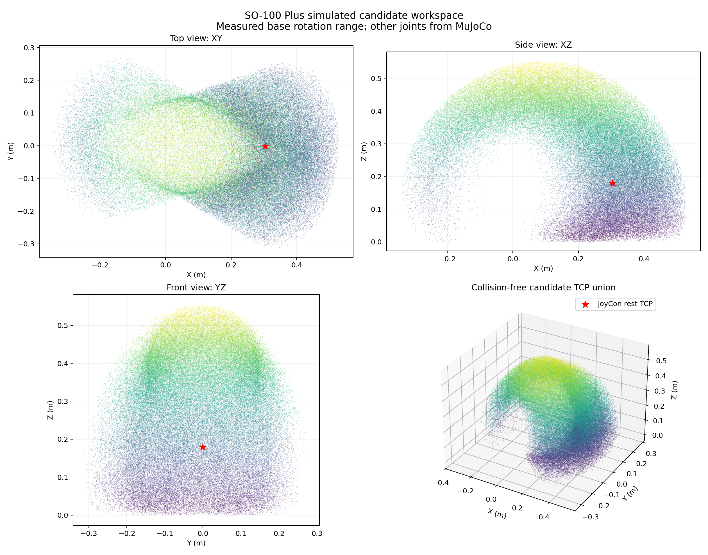
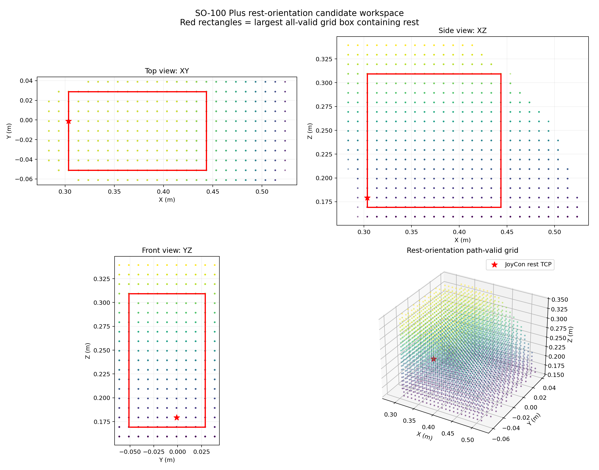

# SO-100 Plus 仿真候选工作空间

本文档记录使用 MuJoCo 对当前 SO-100 Plus `right_follower` 进行的离线
工作空间扫描。扫描没有打开串口、摄像头或任何真实硬件。

> 本结果是仿真候选工作空间，不是真机安全认证范围，也不能把 XYZ
> 独立极值直接复制到 `WorkspaceLimits`。

## 1. 本次扫描回答什么问题

本次扫描回答：

> 在保留实测底座旋转范围、其余关节使用 MuJoCo 模型范围的条件下，
> 夹爪 TCP 在某些关节姿态下能够到达哪些位置，并且该姿态没有被
> MuJoCo 判定为自碰撞或地面碰撞？

它计算的是所有采样姿态的 TCP 位置并集。TCP 姿态没有固定，因此它不等于
“保持任意当前姿态时，`move_to()` 都能到达的范围”。

## 2. 仿真输入

| 项目 | 本次值 |
| --- | --- |
| MuJoCo 场景 | `lerobot/common/robot_devices/controllers/scene_plus.xml` |
| 关节空间采样数 | 1,000,000 |
| 采样方式 | 六关节范围内均匀随机采样 |
| 随机种子 | 20260718 |
| TCP | 两根夹指尖端之间的夹持中心 |
| TCP 偏移 | `(0.10127, -0.00690, 0.00118) m` |
| 夹爪模型角 | 0 rad |
| 桌面 | 与底座底部齐平的 `Z=0` 无限支撑平面 |
| 碰撞过滤 | MuJoCo 自碰撞、地面接触、TCP 低于地面 |
| 体素分辨率 | 10 mm |

### 2.1 底座范围

真实驱动角保持用户已经手动确认的范围：

```text
[-19.599609°, 31.201172°]
```

底座驱动角到运动学模型角的符号为 `-1`，所以仿真模型角范围是：

```text
[-31.201172°, 19.599609°]
```

### 2.2 其余五个关节

其余关节逐字使用本次 MuJoCo 文件的关节范围：

| 关节 | 模型最小角 | 模型最大角 |
| --- | ---: | ---: |
| shoulder pitch | -179.9993° | 11.4592° |
| elbow | 0° | 179.9993° |
| wrist pitch | -114.5916° | 103.1324° |
| wrist jaw | -83.0789° | 83.0789° |
| wrist roll | -179.9993° | 179.9993° |

这些范围来自仿真模型，不代表相同角度已经在真机上逐一通过。

## 3. 扫描结果

### 3.1 样本过滤

| 统计 | 数值 |
| --- | ---: |
| 总样本 | 1,000,000 |
| 无碰撞候选样本 | 527,612 |
| 拒绝样本 | 472,388 |
| 无碰撞候选比例 | 52.7612% |
| MuJoCo 报告接触的样本 | 471,905 |
| TCP 低于地面的样本 | 234,936 |
| 有地面接触的样本 | 291,039 |
| 有自碰撞的样本 | 299,542 |

同一个样本可能同时发生地面接触和自碰撞，因此各拒绝原因不能直接相加。

### 3.2 无碰撞候选点的外包围范围

| 坐标轴 | 最小值 | 最大值 | 跨度 |
| --- | ---: | ---: | ---: |
| X | -0.342855 m | 0.530123 m | 0.872979 m |
| Y | -0.311638 m | 0.276831 m | 0.588469 m |
| Z | 0.000006 m | 0.553846 m | 0.553840 m |

这里的三个范围只是点云在各坐标轴上的独立极值。不能据此构造：

```python
WorkspaceLimits(
    x=AxisLimits(-0.342855, 0.530123),
    y=AxisLimits(-0.311638, 0.276831),
    z=AxisLimits(0.000006, 0.553846),
)
```

原因是这个长方体的很多角落和内部组合并没有对应的无碰撞关节姿态。

### 3.3 中央 99% 样本范围

去掉每个坐标轴两端各 0.5% 的样本后：

| 坐标轴 | 0.5% 分位 | 99.5% 分位 |
| --- | ---: | ---: |
| X | -0.284748 m | 0.501486 m |
| Y | -0.264254 m | 0.221102 m |
| Z | 0.009478 m | 0.533791 m |

这个范围对极少数边界样本不那么敏感，但它仍然只是分位外包围盒，
不是一个保证全部可达的长方体。

### 3.4 体素结果

使用 10 mm 立方体离散点云：

| 项目 | 数值 |
| --- | ---: |
| 已占用体素 | 102,807 |
| 近似占用体积 | 0.102807 m³ |

体素结果比单纯 XYZ 最小/最大值更接近真实的弯曲工作空间形状。
它仍然受到采样密度和模型误差影响。

## 4. 可视化

红色星号表示 JoyCon 控制器初始参考姿态下的 TCP。



图中可以看到：

- 工作空间不是长方体；
- 底座受限后，XY 平面左右不完全对称；
- 前方低位区域和后方高位区域的密度不同；
- 某个 XYZ 点可达，不代表以所有夹爪姿态都可达。

## 5. 输出文件

| 文件 | 内容 |
| --- | --- |
| `artifacts/so100_plus_workspace/workspace_report.json` | 完整配置、范围、碰撞与体素统计 |
| `artifacts/so100_plus_workspace/collision_free_tcp_points.npz` | 527,612 个 TCP 候选点和体素索引 |
| `artifacts/so100_plus_workspace/workspace_views.png` | XY、XZ、YZ 和三维点云 |

NPZ 中主要字段：

| 字段 | 说明 |
| --- | --- |
| `tcp_points_m` | 无碰撞候选 TCP 点，形状 `(N, 3)` |
| `voxel_origin_m` | 体素网格原点 |
| `occupied_voxel_indices` | 已占用体素的整数索引 |
| `voxel_size_m` | 体素边长 |
| `rest_tcp_m` | JoyCon 控制器初始参考姿态 TCP（字段保留旧名） |
| `lower_joint_radians` | 本次采样关节下限 |
| `upper_joint_radians` | 本次采样关节上限 |

## 6. 复现命令

```bash
conda activate rosclaw-mini-py310

PYTHONPATH=src:lerobot-joycon_plus \
MPLCONFIGDIR=/tmp/matplotlib-rosclaw \
python scripts/simulate_so100_plus_workspace.py \
  --samples 1000000 \
  --chunk-size 32768 \
  --output-dir artifacts/so100_plus_workspace \
  --voxel-size-mm 10 \
  --max-plot-points 100000
```

脚本会明确输出：

```text
模式：纯离线仿真；串口写入 0，真实机械臂动作 0。
```

它没有真机端口、校准文件或风险确认参数，也不会导入 Feetech 电机驱动。

## 7. 环境假设和没有模拟的内容

根据用户确认，真实桌面只需要视为与底座底部齐平的平面，其他空间没有
外部碰撞物体。因此当前 `scene_plus.xml` 的 `Z=0` 无限地面直接代表桌面，
不需要额外启用有边缘和厚度的桌子网格。

用户安装底座带来的主要限制已经由实测底座驱动角范围表达。额外底座外形
没有单独加入碰撞模型，因为用户确认其余空间没有需要避让的物体。

当前仍未模拟：

- 桌面边缘和厚度；按本次范围定义不需要；
- 实际线缆走向和拉扯；
- 摄像头支架；
- 工具或抓取物；
- 电机负载、重力下垂和回差；
- 温度、电压和电流限制；
- 环境中的人体与其他障碍物。

## 8. 为什么暂时不写入 `limits.py`

当前 `WorkspaceLimits` 是一个三轴长方体，而仿真点云是明显弯曲、
非凸并且与 TCP 姿态相关的三维区域。

直接使用外包围盒会错误允许很多不可达点。直接使用中央 99% 外包围盒
仍然存在同样问题。因此，本次只保存点云、体素和报告。

后续可以有两种做法：

1. 在点云内部选择一个较小的高覆盖长方体，再用 IK 网格逐点验证；
2. 把安全层扩展为体素或其他非长方体工作空间，而不是只检查 XYZ 极值。

## 9. 下一步验证顺序

建议顺序：

1. 对常用夹爪姿态分别扫描，而不是把所有姿态合并；
2. 从点云中选择一个保守的常用区域；
3. 对该区域进行笛卡尔网格 IK 和连续路径检查；
4. 只选择少量内部点与边界代表点进行真机验证；
5. 真机代表点验证后，把每个面内缩 `1 cm` 的长方体登记为
   `SO100_PLUS_RIGHT_FOLLOWER_WORKSPACE_LIMITS`；外层候选框仍不直接使用。

## 10. JoyCon 初始转换姿态参考精扫

上一节的百万点结果是“所有 TCP 姿态的可达位置并集”。为了更接近当前
`move_to()` 保持姿态的实际语义，第二阶段固定
`JoyConController_plus.init_qpos` 的 TCP 旋转矩阵，逐个求解笛卡尔
网格。它不是 README 校准照片中的 `follower_rest` 折叠收纳姿态。

### 10.1 控制器初始转换姿态

```text
模型关节角(rad): (0.0, -3.1, 3.0, 0.0, 0.0, 1.57)
TCP(m):          (0.303571, -0.001185, 0.179328)
```

该姿态的 shoulder pitch 约为 `-177.6°`，elbow 约为 `171.9°`，
都靠近 MuJoCo 模型关节端点。因此其可达区域天然偏向向前、向上展开，
这个初始参考点不可能成为一个上下、前后完全对称工作空间的中心。

### 10.2 最终精扫条件

| 项目 | 数值 |
| --- | ---: |
| 笛卡尔网格步长 | 10 mm |
| 网格形状 | 25 × 11 × 19 |
| 网格点总数 | 5,225 |
| 关节路径检查步长 | 1° |
| 固定姿态 | JoyCon 控制器初始 TCP 旋转矩阵 |
| 支撑平面 | Z=0 |

每个点执行：

1. 从控制器初始关节角求解保持初始 TCP 姿态的 IK；
2. 检查底座实测范围和其他 MuJoCo 关节范围；
3. 使用 FK 复算位置与姿态误差；
4. 检查目标姿态自碰撞和桌面接触；
5. 从控制器初始姿态到目标按最大 1° 关节步长插值；
6. 检查每个中间姿态的自碰撞、桌面接触和 TCP 高度。

### 10.3 网格结果

| 结果 | 数量 |
| --- | ---: |
| 通过 | 4,112 |
| IK 或关节范围失败 | 1,113 |
| 终点碰撞 | 0 |
| 路径碰撞 | 0 |

### 10.4 最大全通过候选长方体

要求：

- 必须包含 JoyCon 控制器初始 TCP；
- 长方体内所有 1 cm 网格点全部通过；
- 每个点的“控制器初始姿态→目标”路径全部通过。

得到：

| 坐标轴 | 最小值 | 最大值 | 跨度 |
| --- | ---: | ---: | ---: |
| X | 0.303571 m | 0.443571 m | 14 cm |
| Y | -0.051185 m | 0.028815 m | 8 cm |
| Z | 0.169328 m | 0.309328 m | 14 cm |

框内共有：

```text
15 × 9 × 15 = 2,025 个 1 cm 网格点
```

近似长方体体积：

```text
0.001568 m³
```

初始参考点位于 X 下边界附近不是算法遗漏，而是 shoulder pitch 和
elbow 已经靠近模型端点。要获得前后更均衡的空间，需要另外定义一个
远离关节端点的中性工作姿态。

### 10.5 框内相邻路径连通性

候选框的每一对相邻 1 cm 网格点都进行了双向检查。每条边都会：

1. 从该边源点的关节姿态重新求解目标点 IK；
2. 检查目标姿态；
3. 按 1° 关节步长检查整条路径。

结果：

```text
11,160 / 11,160 条有向相邻边通过
```

相邻 1 cm 移动中，单关节最大变化约为 `14.74°`。这说明候选框中
存在接近运动学敏感区的点；真实执行仍应使用现有的 30 Hz 流式轨迹和
12°/s 关节速度限制，不能把“1 cm 网格”误解为“关节只变化很小”。

相邻边全部通过证明：如果规划器沿网格相邻点移动，框内存在经过仿真检查的
离散连通路径。它不证明任意两个远点之间的一次直线关节插值都安全。

### 10.6 输出文件

| 文件 | 内容 |
| --- | --- |
| `artifacts/so100_plus_rest_workspace/rest_workspace_report.json` | 固定姿态网格和候选框报告 |
| `artifacts/so100_plus_rest_workspace/rest_workspace_grid.npz` | 网格状态与目标关节解 |
| `artifacts/so100_plus_rest_workspace/rest_workspace_views.png` | 固定姿态有效点和候选框 |



复现命令：

```bash
PYTHONPATH=src:lerobot-joycon_plus \
MPLCONFIGDIR=/tmp/matplotlib-rosclaw \
python scripts/simulate_so100_plus_rest_workspace.py \
  --grid-step-mm 10 \
  --path-step-degrees 1 \
  --bounds-m \
    0.2835714232672181 0.5235714232672181 \
    -0.061185494280163625 0.03881450571983638 \
    0.15932848288990053 0.3393284828899006 \
  --output-dir artifacts/so100_plus_rest_workspace
```

扫描实现现位于 `src/rosclaw_mini/workspace_scan/so100_plus.py`；上述脚本
只是为了兼容旧命令而保留的入口。独立包的结构与迁移说明见
`src/rosclaw_mini/workspace_scan/README.md`。

### 10.7 当前决定

这组数值可以作为下一轮少量真机验证的候选范围，但暂时不写入
`limits.py` 的真机默认配置，原因是：

- 只有仿真网格通过；
- 真机回差、下垂、线缆和负载没有进入模型；
- rest 本身靠近模型关节边界；
- 当前 Adapter 尚未实现基于网格的碰撞路径规划；
- `WorkspaceLimits` 只能检查 XYZ 长方体，不能保证实际规划路径沿已验证网格。
